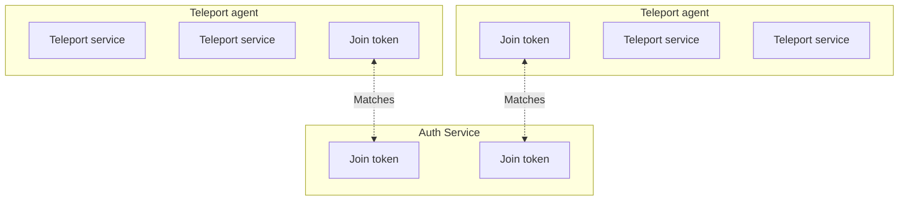

An agent is a Teleport instance configured to run one or more Teleport services
in order to proxy infrastructure resources. For a brief architectural overview
of how agents run in a Teleport cluster, read the [Introduction to Teleport
Agents](/agents/introduction).

This guide shows you how to deploy a pool of Teleport agents by declaring it as
code using Terraform.

There are several methods you can use to join a Teleport agent to your cluster,
which we discuss in the [Joining Services to your
Cluster](/agents/join-services-to-your-cluster) guide. In this guide, we will use
the **join token** method, where the operator stores a secure token on the Auth
Service, and an agent presents the token in order to join a cluster.

No matter which join method you use, it will involve the following Terraform
resources:

- Compute instances to run Teleport services
- A join token for each compute instance in the agent pool



## Prerequisites

<Tabs>
  <Tab title="Teleport Community Edition">
    - A running Teleport cluster. For details on how to set this up, see the
      [Getting Started](/index) guide.

    - The `tctl` admin tool and `tsh` client tool version >= 15.0.0-dev.

      See [Installation](/installation) for details.

    To check version information, run the `tctl version` and `tsh version` commands.
    For example:

    ```code
    $ tctl version
    # Teleport v15.0.0-dev git:api/14.0.0-gd1e081e go1.21
      
    $ tsh version
    # Teleport v15.0.0-dev go1.21
    Proxy version: 15.0.0-dev
    Proxy: teleport.example.com
    ```
  </Tab>

  <Tab title="Teleport Team">
    - A Teleport Team account. If you don't have an account, sign
      up to begin your [free trial](https://goteleport.com/signup/).

    - The Enterprise `tctl` admin tool and `tsh` client tool, version >= 13.4.3.

      You can download these tools from the [Cloud Downloads page](/choose-an-edition/teleport-cloud/downloads).

    To check version information, run the `tctl version` and `tsh version` commands.
    For example:

    ```code
    $ tctl version
    # Teleport Enterprise v13.4.3 git:api/14.0.0-gd1e081e go1.21
      
    $ tsh version
    # Teleport v13.4.3 go1.21
    Proxy version: 13.4.3
    Proxy: teleport.example.com
    ```
  </Tab>

  <Tab title="Teleport Enterprise">
    - A running Teleport Enterprise cluster. For details on how to set this up, see the Enterprise
      [Getting Started](/choose-an-edition/teleport-enterprise/introduction) guide.

    - The Enterprise `tctl` admin tool and `tsh` client tool version >=
      15.0.0-dev.

      You can download these tools by visiting your [Teleport
      account workspace](https://teleport.sh).

    To check version information, run the `tctl version` and `tsh version` commands.
    For example:

    ```code
    $ tctl version
    # Teleport Enterprise v15.0.0-dev git:api/14.0.0-gd1e081e go1.21
      
    $ tsh version
    # Teleport v15.0.0-dev go1.21
    Proxy version: 15.0.0-dev
    Proxy: teleport.example.com
    ```
  </Tab>

  <Tab title="Teleport Enterprise Cloud">
    - A Teleport Enterprise Cloud account. If you don't have an account,
      sign up to begin a [free trial](https://goteleport.com/signup/)  of Teleport Team
      and upgrade to Teleport Enterprise Cloud.

    - The Enterprise `tctl` admin tool and `tsh` client tool version >= 13.4.3.

      You can download these tools from the [Cloud Downloads page](/choose-an-edition/teleport-cloud/downloads).

    To check version information, run the `tctl version` and `tsh version` commands.
    For example:

    ```code
    $ tctl version
    # Teleport Enterprise v13.4.3 git:api/14.0.0-gd1e081e go1.21
      
    $ tsh version
    # Teleport v13.4.3 go1.21
    Proxy version: 13.4.3
    Proxy: teleport.example.com
    ```
  </Tab>
</Tabs>

<Tip>
  We recommend following this guide on a fresh Teleport demo cluster so you can
  see how an agent pool works. After you are familiar with the setup, apply the
  lessons from this guide to protect your infrastructure. You can get started with
  a demo cluster using:

  - A demo deployment on a [Linux server](/index)
  - A [Teleport Team trial](https://goteleport.com/signup)
</Tip>

- An AWS account with permissions to create EC2 instances.
- Terraform v1.0.0.
- An identity file for the Teleport Terraform provider. Make sure you are
  familiar with [how to set up the Teleport Terraform
  provider](/management/dynamic-resources/terraform-provider) before following this
  guide.
- To check that you can connect to your Teleport cluster, sign in with `tsh login`, then
  verify that you can run `tctl` commands using your current credentials.
  `tctl` is supported on macOS and Linux machines.

  For example:
  ```code
  $ tsh login --proxy=teleport.example.com --user=email@example.com
  $ tctl status
  # Cluster  teleport.example.com
  # Version  15.0.0-dev
  # CA pin   sha256:abdc1245efgh5678abdc1245efgh5678abdc1245efgh5678abdc1245efgh5678
  ```
  If you can connect to the cluster and run the `tctl status` command, you can use your
  current credentials to run subsequent `tctl` commands from your workstation.
  If you host your own Teleport cluster, you can also run `tctl` commands on the computer that
  hosts the Teleport Auth Service for full permissions.

## Step 1/3. Fetch the example Terraform configuration

Fetch the Teleport code repository and copy the example Terraform configuration
for this project into your current working directory:

```code
$ git clone --depth=1 https://github.com/gravitational/teleport
$ cp -R teleport/examples/agent-pool-terraform .
$ rm -rf teleport
```

Move the identity file for the Teleport Terraform provider into your project
directory so the Terraform provider an access it. Name the file
`terraform-identity`.

<Warning>
  If you don't have an identify file available, make sure you have followed the
  [prerequisites for this guide](#prerequisites).
</Warning>

## Step 2/3. Prepare your Terraform configuration

After you have copied the example Terraform configuration, you will assign input
variables and apply your new resources. First, we will explain the Terraform
resource configuration you copied so you can understand how to deploy an agent
pool in your infrastructure.

### Instances and tokens

The file `agent-pool.tf` configures EC2 instances and Teleport join tokens:

```hcl
resource "random_string" "token" {
  count  = var.agent_count
  length = 32
}

resource "teleport_provision_token" "agent" {
  count = var.agent_count
  spec = {
    roles = [
      "Node",
      "App",
      "Db",
      "Kube",
    ]
    name = random_string.token[count.index].result
  }
  metadata = {
    expires = timeadd(timestamp(), "1h")
  }
}

resource "aws_instance" "teleport_agent" {
  count = var.agent_count
  # Amazon Linux 2023 64-bit x86
  ami           = "ami-04a0ae173da5807d3"
  instance_type = "t3.small"
  subnet_id     = var.subnet_id
  user_data = templatefile("./userdata", {
    token                 = teleport_provision_token.agent[count.index].metadata.name
    proxy_service_address = var.proxy_service_address
    teleport_version      = var.teleport_version
  })

  // The following two blocks adhere to security best practices.

  metadata_options {
    http_endpoint = "enabled"
    http_tokens   = "required"
  }

  root_block_device {
    encrypted = true
  }
}

```

In this minimal example, we deploy one EC2 instance for each Teleport agent.
Each agent joins the cluster using a token. We create each token using the
`teleport_provision_token` Terraform resource, specifying the token's value with
a `random_string` resource.

When we apply the `teleport_provision_token` resources, the Teleport Terraform
provider creates them on the Teleport Auth Service backend. Each EC2 instance
presents the token in order to establish trust with the cluster.

The Auth Service associates the join token with one or more roles, identifying
the Teleport service that is allowed to use the token. The configuration above
generates tokens for the following Teleport services:

- Teleport SSH Service (`Node`)
- Teleport Application Service (`App`)
- Teleport Database Service (`Db`)
- Teleport Kubernetes Service (`Kube`)

### Startup script

Each EC2 instance runs a script on startup, which we configured above using the
`user_data` field within the `aws_instance.teleport_agent` resource
(`examples/agent-pool-terraform/userdata`):

```text
#!/bin/bash

curl https://goteleport.com/static/install.sh | bash -s ${teleport_version}

echo ${token} > /var/lib/teleport/token
cat<<EOF >/etc/teleport.yaml
version: v3
teleport:
  auth_token: /var/lib/teleport/token
  proxy_server: ${proxy_service_address}
app_service:
  enabled: true
  resources:
  - labels:
      "*": "*"
auth_service:
  enabled: false
db_service:
  enabled: true
  resources:
  - labels:
      "*": "*"
discovery_service:
  enabled: true
kubernetes_service:
  enabled: true
  resources:
  - labels:
      "*": "*"
proxy_service:
  enabled: false
ssh_service:
  labels:
    role: agent-pool
EOF

systemctl restart teleport;

```

This script installs Teleport Community Edition on the host, then writes a
configuration file to the default location, `/etc/teleport.yaml`. The
configuration file enables each Teleport service we associated with our token.

The configuration also adds the `role: agent-pool` label to the Teleport SSH
Service on each instance. This will make it easier to access hosts in the agent
pool later.

Finally, the script restarts Teleport on the host to apply the new
configuration.

### Input variables

The Terraform configuration we show in this guide relies on the following inputs
(`examples/agent-pool-terraform/inputs.tf`):

```hcl
variable "agent_count" {
  type        = number
  description = "Number of agents to deploy"
}

variable "proxy_service_address" {
  type        = string
  description = "Host and HTTPS port of the Teleport Proxy Service"
}

variable "aws_region" {
  type        = string
  description = "Region in which to deploy AWS resources"
}

variable "teleport_version" {
  type        = string
  description = "Version of Teleport to install on each agent"
}

variable "subnet_id" {
  type        = string
  description = "ID of the AWS subnet for deploying Teleport agents"
}

```

In your `agent-pool-terraform` project directory, create a file called
`main.auto.tfvars` with the following content:

```hcl
agent_count=2
proxy_service_address="mytenant.teleport.sh"
aws_region=""
teleport_version=15.0.0-dev
subnet_id=""
```

Assign `agent_count` to `2` for high availability. As you scale your Teleport
usage, you can increase this count to ease the load on each agent. You can
consider adding your agents to an Auto Scaling group as well.

Assign `proxy_service_address` to the host and HTTPS port of your Teleport Proxy
Service, e.g., `mytenant.teleport.sh:443`.

<Tip>
  Make sure to include the port.
</Tip>

Assign `aws_region` to your AWS region, e.g., `us-east-1`.

For `subnet_id`, include the ID of the AWS subnet where you will deploy Teleport
agents.

Finally, make sure you are using the latest supported version of the Teleport
Terraform provider. The `required_providers` block for the Teleport provider
includes a placeholder value:

```hcl
terraform {
  required_providers {
    teleport = {
      source  = "terraform.releases.teleport.dev/gravitational/teleport"
      version = "TELEPORT_VERSION"
    }

    aws = {
      source  = "hashicorp/aws"
      version = "~> 4.0"
    }
  }
}

provider "aws" {
  region = var.aws_region
}

provider "teleport" {
  # Update addr to point to your Teleport Cloud tenant URL's host:port
  addr               = var.proxy_service_address
  identity_file_path = "terraform-identity"
}

```

Replace the placeholder value with the latest version:

```code
$ sed -i "" "s/TELEPORT_VERSION/13.3.7/" provider.tf
```

## Step 3/3. Verify the deployment

Make sure your AWS credentials are available to Terraform using the standard
approach for your organization.

Apply the Terraform configuration:

```code
$ terraform apply
```

Once the `apply` command completes, run the following command to verify that the
two agents have deployed successfully:

```code
$ tsh ls role=agent-pool
Node Name                  Address    Labels
-------------------------- ---------- ---------------
ip-10-1-1-187.ec2.internal ⟵ Tunnel   role=agent-pool
ip-10-1-1-24.ec2.internal  ⟵ Tunnel   role=agent-pool
```

## Next step: Enroll infrastructure resources

There are two ways to configure your agent pool to protect infrastructure
resources with Teleport, which we describe below.

### Define dynamic resources in Terraform

You can declare Terraform resources that enroll your infrastructure with
Teleport. The Teleport Terraform provider currently supports the following:

| Infrastructure Resource | Terraform Resource  |
| ----------------------- | ------------------- |
| Application             | `teleport_app`      |
| Database                | `teleport_database` |

To declare a dynamic resource with Terraform, add a configuration block similar
to the ones below to a `*.tf` file in your `agent-pool-terraform` project
directory.

The Teleport Terraform provider creates these on the Auth Service backend, and
the relevant Teleport services query them in order to proxy user traffic. For a
full list of supported resources and fields, see the [Terraform provider
reference](/reference/terraform-provider).

<Tabs>
  <Tab title="Application">
    ```hcl
    resource "teleport_app" "example" {
      metadata = {
        name        = "example"
        description = "Test app"
        labels = {
          // Teleport adds this label by default, so add it here to
          // ensure a consistent state.
          "teleport.dev/origin" = "dynamic"
        }
      }

      spec = {
        uri = "localhost:3000"
      }
    }
    ```
  </Tab>

  <Tab title="Database">
    ```hcl
    resource "teleport_database" "example" {
      metadata = {
        name        = "example"
        description = "Test database"
        labels = {
          // Teleport adds this label by default, so add it here to
          // ensure a consistent state.
          "teleport.dev/origin" = "dynamic"
        }
      }

      spec = {
        protocol = "postgres"
        uri      = "localhost"
      }
    }
    ```
  </Tab>
</Tabs>

### Configure Teleport services in the agent pool

Each Teleport service reads its local configuration file (`/etc/teleport.yaml`
by default) to determine which infrastructure resources to proxy. You can edit
this configuration file to enroll resources with Teleport.

In the setup we explored in this guide, you can edit the user data script for
each instance to add configuration settings to, for example, the
`database_service` or `kubernetes_service` sections.

To see how to configure each service, read its section of the documentation:

- [SSH Service](/server-access/introduction)
- [Database Service](/database-access/introduction)
- [Kubernetes Service](/kubernetes-access/introduction)
- [Windows Desktop Service](/desktop-access/introduction)
- [Application Service](/application-access/introduction)
