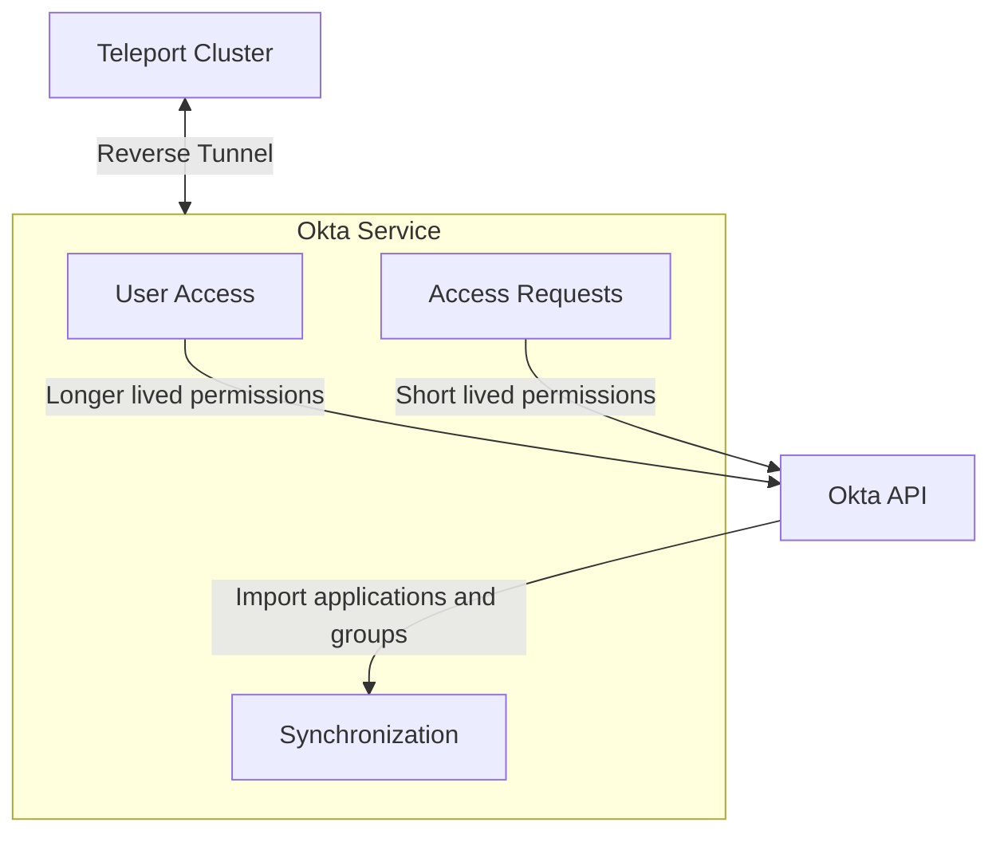

This document will go into details on how the Okta Service is organized and how
it functions.

## How does the Okta integration work?

Teleport provides an Okta Service that is responsible for dealing with all
interactions with Okta. There are three main components of the Okta Service:

- Synchronization
- User access
- Access Requests



The Okta Service uses an Okta API token and endpoint in order to interact
with Okta's API. The API is used to import applications and user groups and
manage assignments.

### Synchronization

The synchronization process runs periodically in the Okta Service, occurring every
10 minutes. This service will import both Okta applications and user groups into
Teleport, cleaning up any resources that no longer exist in Okta.

#### Okta Import Rules

During synchronization, labels can be customized for imported applications and user
groups through the use of Okta Import Rules. These objects can be created by
administrators of the Teleport cluster and they will be automatically picked up
during the next synchronization run.

```yaml
kind: okta_import_rule
version: v1
metadata:
  name: test-rule
  description: "Okta import rule for admins"
spec:
  # Okta Import Rules will be applied in the order of the listed priority. Rules
  # with lower numbers will be applied first. In the event of a conflict, labels
  # applied by rules with lower priorities will be overwritten by labels associated
  # with higher priorities.
  priority: 10
  # Mappings describes a list of match directives that describe what labels to
  # apply to specific Okta groups and applications that will be synchronized
  # into Teleport.
  mappings:
  - match:
    # Individual application IDs can be used to create matches. Imported Okta
    # applications will be matched based on the app IDs listed here.
    - app_ids: ["app1", "app2"]
    # These labels will be added to matching applications.
    add_labels:
      app_label: app_label_value
  - match:
    # Similarly, group IDs can be used to create matches.
    - group_ids: ["group1", "group2"]
    # These labels will be added to the groups.
    add_labels:
      label1: value1
  - match:
    # Regexes based on the app name can be used to create matches.
    - app_name_regexes: ["^okta.*$", "app*"]
    # These labels will be added to matching applications.
    add_labels:
      app_label: app_label_value
  - match:
    # Similarly, regexes based on the group name can be used as well.
    - group_name_regexes: ["^okta.*$", "app*"]
    # These labels will be added to the groups.
    add_labels:
      label1: value1
```

### User access

Upon logging into Teleport, users will be granted access to the Okta applications
and user groups that they have access to within Teleport. If a user has RBAC access to
an application or user group, it will be reflected within Okta.

### Access Requests

Users can use Teleport's Just-in-time Access Requests in order to
request temporary access to Okta applications and user groups. Upon expiration of the
access request, the access granted will be revoked within Okta.

## Guide

A guide for setting up a simple Okta Service can be found [here](/application-access/okta/guide).
