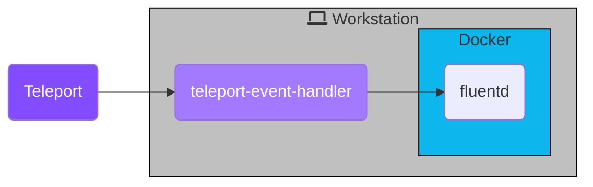

Fluentd is an open source data collector for a unified logging layer. In this
guide, we will:

- Set up Teleport's Event Handler plugin.
- Forward events with Fluentd.

This guide also serves as an explanation for the Teleport Event Handler plugin,
using Fluentd as the target service. We'll create a local Docker container as a
destination for the Event Handler:



You can follow the instructions below for a local proof-of-concept demo, or use any
of the additional installation instructions to configure the Teleport Event Handler
to integrate with your infrastructure.

## Prerequisites

<Tabs>
  <Tab title="Teleport Community Edition">
    - A running Teleport cluster. For details on how to set this up, see the
      [Getting Started](/docs/index) guide.

    - The `tctl` admin tool and `tsh` client tool version >= 15.0.0-dev.

      See [Installation](/docs/installation) for details.

    To check version information, run the `tctl version` and `tsh version` commands.
    For example:

    ```code
    $ tctl version
    # Teleport v15.0.0-dev git:api/14.0.0-gd1e081e go1.21
      
    $ tsh version
    # Teleport v15.0.0-dev go1.21
    Proxy version: 15.0.0-dev
    Proxy: teleport.example.com
    ```
  </Tab>

  <Tab title="Teleport Team">
    - A Teleport Team account. If you don't have an account, sign
      up to begin your [free trial](https://goteleport.com/signup/).

    - The Enterprise `tctl` admin tool and `tsh` client tool, version >= 13.4.3.

      You can download these tools from the [Cloud Downloads page](/docs/choose-an-edition/teleport-cloud/downloads).

    To check version information, run the `tctl version` and `tsh version` commands.
    For example:

    ```code
    $ tctl version
    # Teleport Enterprise v13.4.3 git:api/14.0.0-gd1e081e go1.21
      
    $ tsh version
    # Teleport v13.4.3 go1.21
    Proxy version: 13.4.3
    Proxy: teleport.example.com
    ```
  </Tab>

  <Tab title="Teleport Enterprise">
    - A running Teleport Enterprise cluster. For details on how to set this up, see the Enterprise
      [Getting Started](/docs/choose-an-edition/teleport-enterprise/introduction) guide.

    - The Enterprise `tctl` admin tool and `tsh` client tool version >=
      15.0.0-dev.

      You can download these tools by visiting your [Teleport
      account workspace](https://teleport.sh).

    To check version information, run the `tctl version` and `tsh version` commands.
    For example:

    ```code
    $ tctl version
    # Teleport Enterprise v15.0.0-dev git:api/14.0.0-gd1e081e go1.21
      
    $ tsh version
    # Teleport v15.0.0-dev go1.21
    Proxy version: 15.0.0-dev
    Proxy: teleport.example.com
    ```
  </Tab>

  <Tab title="Teleport Enterprise Cloud">
    - A Teleport Enterprise Cloud account. If you don't have an account,
      sign up to begin a [free trial](https://goteleport.com/signup/)  of Teleport Team
      and upgrade to Teleport Enterprise Cloud.

    - The Enterprise `tctl` admin tool and `tsh` client tool version >= 13.4.3.

      You can download these tools from the [Cloud Downloads page](/docs/choose-an-edition/teleport-cloud/downloads).

    To check version information, run the `tctl version` and `tsh version` commands.
    For example:

    ```code
    $ tctl version
    # Teleport Enterprise v13.4.3 git:api/14.0.0-gd1e081e go1.21
      
    $ tsh version
    # Teleport v13.4.3 go1.21
    Proxy version: 13.4.3
    Proxy: teleport.example.com
    ```
  </Tab>
</Tabs>

- Fluentd version v1.12.4 or greater.

- Docker version v20.10.7.

- To check that you can connect to your Teleport cluster, sign in with `tsh login`, then
  verify that you can run `tctl` commands using your current credentials.
  `tctl` is supported on macOS and Linux machines.

  For example:
  ```code
  $ tsh login --proxy=teleport.example.com --user=email@example.com
  $ tctl status
  # Cluster  teleport.example.com
  # Version  15.0.0-dev
  # CA pin   sha256:abdc1245efgh5678abdc1245efgh5678abdc1245efgh5678abdc1245efgh5678
  ```
  If you can connect to the cluster and run the `tctl status` command, you can use your
  current credentials to run subsequent `tctl` commands from your workstation.
  If you host your own Teleport cluster, you can also run `tctl` commands on the computer that
  hosts the Teleport Auth Service for full permissions.

- On your workstation, create a folder called `event-handler`, to hold configuration files and plugin state:

  ```code
  $ mkdir -p event-handler
  $ cd event-handler
  ```

## Step 1/6. Install the event handler plugin

The Teleport event handler runs alongside the Fluentd forwarder, receives events
from Teleport's events API, and forwards them to Fluentd.

<Tabs>
  <Tab title="Linux">
    ```code
    $ curl -L -O https://get.gravitational.com/teleport-event-handler-v13.3.7-linux-amd64-bin.tar.gz
    $ tar -zxvf teleport-event-handler-v13.3.7-linux-amd64-bin.tar.gz
    $ sudo ./teleport-event-handler/install
    ```

    We currently only build the Event Handler plugin for amd64 machines. For ARM
    architecture, you can build from source.
  </Tab>

  <Tab title="macOS">
    ```code
    $ curl -L -O https://get.gravitational.com/teleport-event-handler-v13.3.7-darwin-amd64-bin.tar.gz
    $ tar -zxvf teleport-event-handler-v13.3.7-darwin-amd64-bin.tar.gz
    $ sudo ./teleport-event-handler/install
    ```

    We currently only build the event handler plugin for amd64 machines. If your
    macOS machine uses Apple silicon, you will need to [install
    Rosetta](https://support.apple.com/en-us/HT211861) before you can run the
    event handler plugin. You can also build from source.
  </Tab>

  <Tab title="Docker">
    Ensure that you have Docker installed and running.

    ```code
    $ docker pull public.ecr.aws/gravitational/teleport-plugin-event-handler:13.3.7
    ```
  </Tab>

  <Tab title="Helm">
    To allow Helm to install charts that are hosted in the Teleport Helm repository, use `helm repo add`:

    ```code
    $ helm repo add teleport https://charts.releases.teleport.dev
    ```

    To update the cache of charts from the remote repository, run `helm repo update`:

    ```code
    $ helm repo update
    ```
  </Tab>

  <Tab title="Build via Docker">
    Ensure that you have Docker installed and running.

    Run the following commands to build the plugin:

    ```code
    $ git clone https://github.com/gravitational/teleport-plugins.git --depth 1
    $ cd teleport-plugins/event-handler/build.assets
    $ make build
    ```

    You can find the compiled binary within your clone of the `teleport-plugins`
    repo, with the file path, `event-handler/build/teleport-event-handler`.
  </Tab>

  <Tab title="Build via Go">
    You will need Go >= 1.21 installed.

    Run the following commands on your Universal Forwarder host:

    ```code
    $ git clone https://github.com/gravitational/teleport-plugins.git --depth 1
    $ cd teleport-plugins/event-handler
    $ go build
    ```

    The resulting executable will have the name `event-handler`. To follow the
    rest of this guide, rename this file to `teleport-event-handler` and move it
    to `/usr/local/bin`.
  </Tab>
</Tabs>

## Step 2/6. Configure the plugin

<Tabs>
  <Tab title="Cloud-Hosted">
    Run the `configure` command to generate a sample configuration. Replace
    `mytenant.teleport.sh` with the DNS name of your Teleport Team or Teleport
    Enterprise Cloud tenant:

    ```code
    $ teleport-event-handler configure . mytenant.teleport.sh:443
    ```
  </Tab>

  <Tab title="Self-Hosted">
    Run the `configure` command to generate a sample configuration. Replace
    `teleport.example.com:443` with the DNS name and HTTPS port of Teleport's Proxy
    Service:

    ```code
    $ teleport-event-handler configure . teleport.example.com:443
    ```
  </Tab>

  <Tab title="Helm Chart">
    Run the `configure` command to generate a sample configuration. Assign
    `TELEPORT_CLUSTER_ADDRESS` to the DNS name and port of your Teleport Auth
    Service or Proxy Service:

    ```code
    $ TELEPORT_CLUSTER_ADDRESS=mytenant.teleport.sh:443
    $ docker run -v `pwd`:/opt/teleport-plugin -w /opt/teleport-plugin public.ecr.aws/gravitational/teleport-plugin-event-handler:13.3.7 configure . ${TELEPORT_CLUSTER_ADDRESS?}
    ```

    In order to export audit events, you'll need to have the root certificate and the
    client credentials available as a secret. Use the following command to create
    that secret in Kubernetes:

    ```code
    $ kubectl create secret generic teleport-event-handler-client-tls --from-file=ca.crt=ca.crt,client.crt=client.crt,client.key=client.key
    ```

    This will pack the content of `ca.crt`, `client.crt`, and `client.key` into the
    secret so the Helm chart can mount them to their appropriate path.
  </Tab>
</Tabs>

You'll see the following output:

```txt
Teleport event handler 15.0.0-dev

[1] mTLS Fluentd certificates generated and saved to ca.crt, ca.key, server.crt, server.key, client.crt, client.key
[2] Generated sample teleport-event-handler role and user file teleport-event-handler-role.yaml
[3] Generated sample fluentd configuration file fluent.conf
[4] Generated plugin configuration file teleport-event-handler.toml
```

The plugin generates several setup files:

```code
$ ls -l
# -rw------- 1 bob bob     1038 Jul  1 11:14 ca.crt
# -rw------- 1 bob bob     1679 Jul  1 11:14 ca.key
# -rw------- 1 bob bob     1042 Jul  1 11:14 client.crt
# -rw------- 1 bob bob     1679 Jul  1 11:14 client.key
# -rw------- 1 bob bob      541 Jul  1 11:14 fluent.conf
# -rw------- 1 bob bob     1078 Jul  1 11:14 server.crt
# -rw------- 1 bob bob     1766 Jul  1 11:14 server.key
# -rw------- 1 bob bob      260 Jul  1 11:14 teleport-event-handler-role.yaml
# -rw------- 1 bob bob      343 Jul  1 11:14 teleport-event-handler.toml
```

| File(s)                            | Purpose                                                             |
| ---------------------------------- | ------------------------------------------------------------------- |
| `ca.crt` and `ca.key`              | Self-signed CA certificate and private key for Fluentd              |
| `server.crt` and `server.key`      | Fluentd server certificate and key                                  |
| `client.crt` and `client.key`      | Fluentd client certificate and key, all signed by the generated CA  |
| `teleport-event-handler-role.yaml` | `user` and `role` resource definitions for Teleport's event handler |
| `fluent.conf`                      | Fluentd plugin configuration                                        |

<Accordion title="Running the Event Handler separately from the log forwarder">
  This guide assumes that you are running the Event Handler on the same host or
  Kubernetes pod as your log forwarder. If you are not, you will need to instruct
  the Event Handler to generate mTLS certificates for subjects besides
  `localhost`. To do this, use the `--cn` and `--dns-names` flags of the
  `teleport-event-handler` configure command.

  For example, if your log forwarder is addressable at `forwarder.example.com` and the
  Event Handler at `handler.example.com`, you would run the following `configure`
  command:

  ```code
  $ teleport-event-handler configure --cn=handler.example.com --dns-names=forwarder.example.com
  ```

  The command generates client and server certificates with the subjects set to
  the value of `--cn`.

  The `--dns-names` flag accepts a comma-separated list of DNS names. It will
  append subject alternative names (SANs) to the server certificate (the one you
  will provide to your log forwarder) for each DNS name in the list. The Event
  Handler looks up each DNS name before appending it as an SAN and exits with an
  error if the lookup fails.
</Accordion>

If you have an existing Fluentd setup with TLS, issue a client certificate and
key from the same certificate authority for the Teleport Event Handler to use.

## Step 3/6. Create a user and role for reading audit events

The `teleport-event-handler configure` command generated a file called
`teleport-event-handler-role.yaml`. This file defines a `teleport-event-handler`
role and a user with read-only access to the `event` API:

```yaml
kind: role
metadata:
  name: teleport-event-handler
spec:
  allow:
    rules:
      - resources: ['event', 'session']
        verbs: ['list','read']
version: v5
---
kind: user
metadata:
  name: teleport-event-handler
spec:
  roles: ['teleport-event-handler']
version: v2
```

Move this file to your workstation (or recreate it by pasting the snippet above)
and use `tctl` on your workstation to create the role and the user:

```code
$ tctl create -f teleport-event-handler-role.yaml
# user "teleport-event-handler" has been created
# role 'teleport-event-handler' has been created
```

## Step 4/6. Create teleport-event-handler credentials

### Enable impersonation of the Fluentd plugin user

In order for the Fluentd plugin to forward events from your Teleport cluster, it
needs a signed identity file from the cluster's certificate authority. The
Fluentd user cannot request this itself, and requires another user to
**impersonate** this account in order to request a certificate.

Create a role that enables your user to impersonate the Fluentd user. First,
paste the following YAML document into a file called
`teleport-event-handler-impersonator.yaml`:

```yaml
kind: role
version: v5
metadata:
  name: teleport-event-handler-impersonator
spec:
  # SSH options used for user sessions
  options:
    # max_session_ttl defines the TTL (time to live) of SSH certificates
    # issued to the users with this role.
    max_session_ttl: 10h

  # allow section declares a list of resource/verb combinations that are
  # allowed for the users of this role. by default nothing is allowed.
  allow:
    impersonate:
      users: ["teleport-event-handler"]
      roles: ["teleport-event-handler"]
```

Next, create the role:

```code
$ tctl create -f teleport-event-handler-impersonator.yaml
```

Assign the `teleport-event-handler-impersonator` role to your Teleport user by running the appropriate
commands for your authentication provider:

<Tabs>
  <Tab title="Local User">
    1. Retrieve your local user's configuration resource:

       ```code
       $ tctl get users/$(tsh status -f json | jq -r '.active.username') > out.yaml
       ```

    2. Edit `out.yaml`, adding `teleport-event-handler-impersonator` to the list of existing roles:

       ```diff
         roles:
          - access
          - auditor
          - editor
       +  - teleport-event-handler-impersonator 
       ```

    3. Apply your changes:

       ```code
       $ tctl create -f out.yaml
       ```

    4. Sign out of the Teleport cluster and sign in again to assume the new role.
  </Tab>

  <Tab title="GitHub">
    1. Retrieve your `github` authentication connector:

       ```code
       $ tctl get github/github --with-secrets > github.yaml
       ```

       Note that the `--with-secrets` flag adds the value of `spec.signing_key_pair.private_key`
       to the `github.yaml` file. Because this key contains a sensitive value, you should remove the
       github.yaml file immediately after updating the resource.

    2. Edit `github.yaml`, adding `teleport-event-handler-impersonator` to the `teams_to_roles` section.

       The team you should map to this role depends on how you have designed your
       organization's role-based access controls (RBAC). However, the team must include your user account and
       should be the smallest team possible within your organization.

       Here is an example:

       ```diff
         teams_to_roles:
           - organization: octocats
             team: admins
             roles:
               - access
       +       - teleport-event-handler-impersonator
       ```

    3. Apply your changes:

       ```code
       $ tctl create -f github.yaml
       ```

    4. Sign out of the Teleport cluster and sign in again to assume the new role.
  </Tab>

  <Tab title="SAML">
    1. Retrieve your `saml`  configuration resource:

       ```code
       $ tctl get --with-secrets saml/mysaml > saml.yaml
       ```

       Note that the `--with-secrets` flag adds the value of `spec.signing_key_pair.private_key`
       to the `saml.yaml` file. Because this key contains a sensitive value, you should remove the
       saml.yaml file immediately after updating the resource.

    2. Edit `saml.yaml`, adding `teleport-event-handler-impersonator` to the `attributes_to_roles` section.

       The attribute you should map to this role depends on how you have designed your
       organization's role-based access controls (RBAC). However, the group must include your
       user account and should be the smallest group possible within your organization.

       Here is an example:

       ```diff
         attributes_to_roles:
           - name: "groups"
             value: "my-group"
             roles:
               - access
       +       - teleport-event-handler-impersonator
       ```

    3. Apply your changes:

       ```code
       $ tctl create -f saml.yaml
       ```

    4. Sign out of the Teleport cluster and sign in again to assume the new role.
  </Tab>

  <Tab title="OIDC">
    1. Retrieve your `oidc`  configuration resource:

       ```code
       $ tctl get oidc/myoidc --with-secrets > oidc.yaml
       ```

       Note that the `--with-secrets` flag adds the value of `spec.signing_key_pair.private_key`
       to the `oidc.yaml` file. Because this key contains a sensitive value, you should remove the
       oidc.yaml file immediately after updating the resource.

    2. Edit `oidc.yaml`, adding `teleport-event-handler-impersonator` to the `claims_to_roles` section.

       The claim you should map to this role depends on how you have designed your organization's
       role-based access controls (RBAC). However, the group must include your user account and
       should be the smallest group possible within your organization.

       Here is an example:

       ```diff
         claims_to_roles:
           - name: "groups"
             value: "my-group"
             roles:
               - access
       +       - teleport-event-handler-impersonator
       ```

    3. Apply your changes:

       ```code
       $ tctl create -f oidc.yaml
       ```

    4. Sign out of the Teleport cluster and sign in again to assume the new role.
  </Tab>
</Tabs>

### Export an identity file for the Fluentd plugin user

The Fluentd Teleport plugin uses the `teleport-event-handler` role and user to
read events. We export an identity file for the user with the `tctl auth sign`
command.

<Tabs>
  <Tab title="Self-Hosted">
    ```code
    $ tctl auth sign --user=teleport-event-handler --out=identity
    ```

    This command creates one PEM-encoded file, `identity`. The identity file
    includes both TLS and SSH credentials. The Event Handler plugin uses the SSH
    credentials to connect to the Proxy Service, which establishes a reverse tunnel
    connection to the Auth Service. The plugin uses this reverse tunnel, along with
    your TLS credentials, to connect to the Auth Service's gRPC endpoint.
  </Tab>

  <Tab title="Cloud-Hosted">
    ```code
    $ tctl auth sign --user=teleport-event-handler --out=identity
    ```

    This command creates one PEM-encoded file, `identity`. The identity file
    includes both TLS and SSH credentials. Your Event Handler plugin uses the SSH
    credentials to connect to the Proxy Service, which establishes a reverse tunnel
    connection to the Auth Service. The plugin uses this reverse tunnel, along with
    your TLS credentials, to connect to the Auth Service's gRPC endpoint.
  </Tab>

  <Tab title="Helm Chart">
    If you are planning to use the Helm Chart, you'll need to generate the keys
    with the `file` format, then create a secret in Kubernetes.

    Create the identity using the following command:

    ```code
    $ tctl auth sign --format=file --user=teleport-event-handler --out=identity
    ```

    Then create the Kubernetes secret:

    ```code
    $ kubectl create secret generic teleport-event-handler-identity --from-file=auth_id=identity
    ```

    These commands should result in a PEM-encoded file, `identity`, and a secret
    in Kubernetes with the name `teleport-event-handler-identity`.
  </Tab>
</Tabs>

## Step 5/6. Start the Fluentd forwarder

The Fluentd plugin will send events to your Fluentd instance using keys
generated on the previous step.

The `fluent.conf` file generated earlier configures your Fluentd instance to
accept events using TLS and print them:

```
<source>
    @type http
    port 8888

    <transport tls>
        client_cert_auth true

        # We are going to run fluentd in Docker. /keys will be mounted from the host file system.
        ca_path /keys/ca.crt
        cert_path /keys/server.crt
        private_key_path /keys/server.key
        private_key_passphrase ********** # Passphrase generated along with the keys
    </transport>

    <parse>
      @type json
      json_parser oj

      # This time format is used by the plugin. This field is required.
      time_type string
      time_format %Y-%m-%dT%H:%M:%S
    </parse>

    # If the number of events is high, fluentd will start failing the ingestion
    # with the following error message: buffer space has too many data errors.
    # The following configuration prevents data loss in case of a restart and
    # overcomes the limitations of the default fluentd buffer configuration.
    # This configuration is optional.
    # See https://docs.fluentd.org/configuration/buffer-section for more details.
    <buffer>
      @type file
      flush_thread_count 8
      flush_interval 1s
      chunk_limit_size 10M
      queue_limit_length 16
      retry_max_interval 30
      retry_forever true
    </buffer>
</source>

# Events sent to test.log will be dumped to STDOUT.
<match test.log>
  @type stdout
</match>
```

To try out this Fluentd configuration, start your fluentd instance:

```code
$ docker run -u $(id -u ${USER}):$(id -g ${USER}) -p 8888:8888 -v $(pwd):/keys -v $(pwd)/fluent.conf:/fluentd/etc/fluent.conf fluent/fluentd:edge
```

This will consume your current terminal, so open a new one to continue following along.

## Step 6/6. Start the event handler plugin

Earlier, we generated a file called `teleport-event-handler.toml` to configure
the Fluentd event handler. This file includes setting similar to the following:

<Tabs>
  <Tab title="Cloud-Hosted">
    ```toml
    storage = "./storage"
    timeout = "10s"
    batch = 20
    namespace = "default"

    [forward.fluentd]
    ca = "/home/bob/event-handler/ca.crt"
    cert = "/home/bob/event-handler/client.crt"
    key = "/home/bob/event-handler/client.key"
    url = "https://localhost:8888/test.log"

    [teleport]
    addr = "example.teleport.com:443"
    identity = "identity"
    ```

    To start the event handler, run the following command:

    ```code
    $ teleport-event-handler start --config teleport-event-handler.toml
    ```
  </Tab>

  <Tab title="Self-Hosted">
    ```toml
    storage = "./storage"
    timeout = "10s"
    batch = 20
    namespace = "default"

    [forward.fluentd]
    ca = "/home/bob/event-handler/ca.crt"
    cert = "/home/bob/event-handler/client.crt"
    key = "/home/bob/event-handler/client.key"
    url = "https://localhost:8888/test.log"

    [teleport]
    addr = "example.teleport.com:443"
    identity = "identity"
    ```

    To start the Event Handler, run the following command:

    ```code
    $ teleport-event-handler start --config teleport-event-handler.toml
    ```
  </Tab>

  <Tab title="Helm Chart">
    Use the following template to create `teleport-plugin-event-handler-values.yaml`:

    ```yaml
    eventHandler:
      storagePath: "./storage"
      timeout: "10s"
      batch: 20
      namespace: "default"

    teleport:
      address: "example.teleport.com:443"
      identitySecretName: teleport-event-handler-identity

    fluentd:
      url: "https://fluentd.fluentd.svc.cluster.local/events.log"
      sessionUrl: "https://fluentd.fluentd.svc.cluster.local/session.log"
      certificate:
        secretName: "teleport-event-handler-client-tls"
        caPath: "ca.crt"
        certPath: "client.crt"
        keyPath: "client.key"

    persistentVolumeClaim:
      enabled: true
    ```

    To start the event handler in Kubernetes, run the following command:

    ```code
    $ helm install teleport-plugin-event-handler teleport/teleport-plugin-event-handler \
      --values teleport-plugin-event-handler-values.yaml \
      --version 13.3.7
    ```
  </Tab>
</Tabs>

<Note>
  This example will start exporting from `May 5th 2021`:

  ```code
  $ teleport-event-handler start --config teleport-event-handler.toml --start-time "2021-05-05T00:00:00Z"
  ```

  The start time can be set only once, on the first run of the tool.

  If you want to change the time frame later, remove the plugin state directory
  that you specified in the `storage` field of the handler's configuration file.
</Note>

Once the handler starts, you will see notifications about scanned and forwarded events:

```txt
INFO[0046] Event sent id=0b5f2a3e-faa5-4d77-ab6e-362bca0994fc ts="2021-06-08 11:00:56.034 +0000 UTC" type=user.login
...
```

## Troubleshooting connection issues

If the Teleport Event Handler is displaying error logs while connecting to your
Teleport Cluster, ensure that:

- The certificate the Teleport Event Handler is using to connect to your
  Teleport cluster is not past its expiration date. This is the value of the
  `--ttl` flag in the `tctl auth sign` command, which is 12 hours by default.
- Ensure that in your Teleport Event Handler configuration file
  (`teleport-event-handler.toml`), you have provided the correct host *and* port
  for the Teleport Proxy Service or Auth Service.

## Next Steps

Read more about
[impersonation](/docs/access-controls/guides/impersonation)
here.

While this guide uses the `tctl auth sign` command to issue credentials for the
Teleport Event Handler, production clusters should use Machine ID for safer,
more reliable renewals. Read [our guide](/docs/machine-id/getting-started)
to getting started with Machine ID.

To see all of the options you can set in the values file for the
`teleport-plugin-event-handler` Helm chart, consult our [reference
guide](/docs/reference/helm-reference/teleport-plugin-event-handler).
