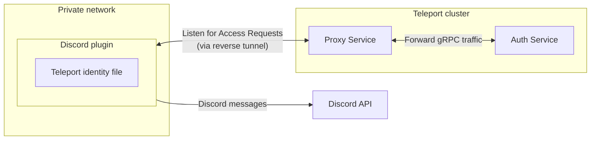

This guide will explain how to set up Discord to receive Access Request messages
from Teleport. Teleport's Discord integration notifies individuals and channels of
Access Requests. Users can then approve and deny Access Requests from within
Discord, making it easier to implement security best practices without
compromising productivity.



## Prerequisites

<Tabs>
  <Tab title="Enterprise">
    - A running Teleport Enterprise cluster, including the Auth Service and Proxy Service. For
      details on how to set this up, see our Enterprise [Getting
      Started](/docs/ver/13.x/choose-an-edition/teleport-enterprise/introduction) guide.

    - The Enterprise `tctl` admin tool and `tsh` client tool version >= 13.2.0,
      which you can download by visiting your [Teleport account](https://teleport.sh).

      ```code
      $ tctl version
      # Teleport Enterprise v13.2.0 go1.20

      $ tsh version
      # Teleport v13.2.0 go1.20
      ```
  </Tab>

  <Tab title="Teleport Enterprise Cloud">
    - A Teleport Enterprise Cloud account. If you do not have one, visit the [signup
      page](https://goteleport.com/signup/) to begin a free trial of Teleport Team
      and upgrade to Teleport Enterprise Cloud.

    - The `tctl` admin tool and `tsh` client tool version >= 13.2.0.
      To download these tools, visit the [Downloads](/docs/ver/13.x/choose-an-edition/teleport-cloud/downloads) page.

      ```code
      $ tctl version
      # Teleport Enterprise v13.2.0 go1.20

      $ tsh version
      # Teleport v13.2.0 go1.20
      ```
  </Tab>
</Tabs>

- Admin account on your Discord server. Installing a bot requires at least the
  "manager server" permission.
- Either a Linux host or Kubernetes cluster where you will run the Discord plugin.
- Make sure you can connect to Teleport. Log in to your cluster using `tsh`, then use `tctl`
  remotely:
  ```code
  $ tsh login --proxy=teleport.example.com --user=email@example.com
  $ tctl status
  # Cluster  teleport.example.com
  # Version  13.2.0
  # CA pin   sha256:abdc1245efgh5678abdc1245efgh5678abdc1245efgh5678abdc1245efgh5678
  ```
  You can run subsequent `tctl` commands in this guide on your local machine.

  For full privileges, you can also run `tctl` commands on your Auth Service host.
  ```code
  $ tsh login --proxy=myinstance.teleport.sh --user=email@example.com
  $ tctl status
  # Cluster  myinstance.teleport.sh
  # Version  13.2.0
  # CA pin   sha256:sha-hash-here
  ```
  You must run subsequent `tctl` commands in this guide on your local machine.

## Step 1/8. Define RBAC resources

Before you set up the Discord plugin, you will need to enable Role Access Requests
in your Teleport cluster.

For the purpose of this guide, we will define an `editor-requester` role, which
can request the built-in `editor` role, and an `editor-reviewer` role that can
review requests for the `editor` role.

Create a file called `editor-request-rbac.yaml` with the following content:

```yaml
kind: role
version: v5
metadata:
  name: editor-reviewer
spec:
  allow:
    review_requests:
      roles: ['editor']
---
kind: role
version: v5
metadata:
  name: editor-requester
spec:
  allow:
    request:
      roles: ['editor']
      thresholds:
        - approve: 1
          deny: 1
```

Create the roles you defined:

```code
$ tctl create -f editor-request-rbac.yaml
role 'editor-reviewer' has been created
role 'editor-requester' has been created
```

Allow yourself to review requests by users with the `editor-requester` role by
assigning yourself the `editor-reviewer` role.

Assign the `editor-reviewer` role to your Teleport user by running the following
commands, depending on whether you authenticate as a local Teleport user or via
the `github`, `saml`, or `oidc` authentication connectors:

<Tabs>
  <Tab title="Local User">
    Retrieve your local user's configuration resource:

    ```code
    $ tctl get users/$(tsh status -f json | jq -r '.active.username') > out.yaml
    ```

    Edit `out.yaml`, adding `editor-reviewer` to the list of existing roles:

    ```diff
      roles:
       - access
       - auditor
       - editor
    +  - editor-reviewer
    ```

    Apply your changes:

    ```code
    $ tctl create -f out.yaml
    ```
  </Tab>

  <Tab title="GitHub">
    Retrieve your `github`  configuration resource:

    ```code
    $ tctl get github/github --with-secrets > github.yaml
    ```

    Edit `github.yaml`, adding `editor-reviewer` to the
    `teams_to_roles` section. The team you will map to this role will depend on how
    you have designed your organization's RBAC, but it should be the smallest team
    possible within your organization. This team must also include your user.

    Here is an example:

    ```diff
      teams_to_roles:
        - organization: octocats
          team: admins
          roles:
            - access
    +       - editor-reviewer
    ```

    Apply your changes:

    ```code
    $ tctl create -f github.yaml
    ```

    <Warning>
      Note the `--with-secrets` flag in the `tctl get` command. This adds the value of
      `spec.signing_key_pair.private_key` to `github.yaml`. This is a sensitive value,
      so take precautions when creating this file and remove it after updating the resource.
    </Warning>
  </Tab>

  <Tab title="SAML">
    Retrieve your `saml`  configuration resource:

    ```code
    $ tctl get --with-secrets saml/mysaml > saml.yaml
    ```

    Edit `saml.yaml`, adding `editor-reviewer` to the
    `attributes_to_roles` section. The attribute you will map to this role will
    depend on how you have designed your organization's RBAC, but it should be the
    smallest group possible within your organization. This group must also include
    your user.

    Here is an example:

    ```diff
      attributes_to_roles:
        - name: "groups"
          value: "my-group"
          roles:
            - access
    +       - editor-reviewer
    ```

    Apply your changes:

    ```code
    $ tctl create -f saml.yaml
    ```

    <Warning>
      Note the `--with-secrets` flag in the `tctl get` command. This adds the value of
      `spec.signing_key_pair.private_key` to `saml.yaml`. This is a sensitive value,
      so take precautions when creating this file and remove it after updating the resource.
    </Warning>
  </Tab>

  <Tab title="OIDC">
    Retrieve your `oidc`  configuration resource:

    ```code
    $ tctl get oidc/myoidc --with-secrets > oidc.yaml
    ```

    Edit `oidc.yaml`, adding `editor-reviewer` to the
    `claims_to_roles` section. The claim you will map to this role will depend on
    how you have designed your organization's RBAC, but it should be the smallest
    group possible within your organization. This group must also include your
    user.

    Here is an example:

    ```diff
      claims_to_roles:
        - name: "groups"
          value: "my-group"
          roles:
            - access
    +       - editor-reviewer
    ```

    Apply your changes:

    ```code
    $ tctl create -f oidc.yaml
    ```

    <Warning>
      Note the `--with-secrets` flag in the `tctl get` command. This adds the value of
      `spec.signing_key_pair.private_key` to `oidc.yaml`. This is a sensitive value,
      so take precautions when creating this file and remove it after updating the resource.
    </Warning>
  </Tab>
</Tabs>

Log out of your Teleport cluster and log in again to assume the new role.

Create a user called `myuser` who has the `editor-requester` role. This user
cannot edit your cluster configuration unless they request the `editor` role:

```code
$ tctl users add myuser --roles=editor-requester 
```

`tctl` will print an invitation URL to your terminal. Visit the URL and log in
as `myuser` for the first time, registering credentials as configured for your
Teleport cluster.

Later in this guide, you will have `myuser` request the `editor` role so you can
review the request using the Teleport plugin.

## Step 2/8. Install the Teleport Discord plugin

We currently only provide `linux-amd64` binaries. You can also compile these
plugins from source. You can run the plugin from a remote host or your local
development machine.

<Tip>
  We recommend installing Teleport plugins on the same host as the Teleport
  Proxy Service. This is an ideal location as plugins have a low memory footprint
  and will require access to both the public internet and the Teleport Auth Service.
</Tip>

<Tabs>
  <Tab title="Download">
    ```code
    $ curl -L -O https://get.gravitational.com/teleport-access-discord-v13.2.0-linux-amd64-bin.tar.gz
    $ tar -xzf teleport-access-discord-v13.2.0-linux-amd64-bin.tar.gz
    $ ./teleport-access-discord/install
    ```

    Make sure the binary is installed:

    ```code
    $ teleport-discord version
    teleport-discord v13.2.0 git:teleport-discord-v13.2.0-fffffffff go1.20
    ```
  </Tab>

  <Tab title="From Source">
    To install from source you need `git` and `go` >= 1.20
    installed.

    ```code
    # Check out the teleport-plugins repository
    $ git clone https://github.com/gravitational/teleport-plugins.git
    $ cd teleport-plugins/access/discord
    $ make
    ```

    Place the `teleport-discord` binary into an appropriate location
    within the system's `PATH`, e.g., `/usr/local/bin`:

    ```code
    $ mv ./build/teleport-discord /usr/local/bin
    ```

    Make sure the binary is installed:

    ```code
    $ teleport-discord version
    teleport-discord v13.2.0 git:teleport-discord-v13.2.0-fffffffff go1.20
    ```
  </Tab>

  <Tab title="Helm Chart">
    ```code
    $ helm repo add teleport https://charts.releases.teleport.dev/
    $ helm repo update
    ```
  </Tab>
</Tabs>

## Step 3/8. Create a user and role for the plugin

Teleport's Access Request plugins authenticate to your Teleport cluster as a
user with permissions to list and read Access Requests. This way, plugins can
retrieve Access Requests from the Teleport Auth Service and present them to
reviewers.

Define a user and role called `access-plugin` by adding the following content to
a file called `access-plugin.yaml`:

```yaml
kind: role
version: v5
metadata:
  name: access-plugin
spec:
  allow:
    rules:
      - resources: ['access_request']
        verbs: ['list', 'read']
      - resources: ['access_plugin_data']
        verbs: ['update']
---
kind: user
metadata:
  name: access-plugin
spec:
  roles: ['access-plugin']
version: v2
```

Create the user and role:

```code
$ tctl create -f access-plugin.yaml
```

As with all Teleport users, the Teleport Auth Service authenticates the
`access-plugin` user by issuing short-lived TLS credentials. In this case, we
will need to request the credentials manually by *impersonating* the
`access-plugin` role and user.

If you are using `tctl` from the Auth
Service host, you will already have impersonation privileges.

To grant your user impersonation privileges for `access-plugin`, define a role
called `access-plugin-impersonator` by pasting the following YAML document into
a file called `access-plugin-impersonator.yaml`:

```yaml
kind: role
version: v5
metadata:
  name: access-plugin-impersonator
spec:
  allow:
    impersonate:
      roles:
      - access-plugin
      users:
      - access-plugin
```

Create the `access-plugin-impersonator` role:

```code
$ tctl create -f access-plugin-impersonator.yaml
```

Assign the `access-plugin-impersonator` role to your Teleport user by running the following
commands, depending on whether you authenticate as a local Teleport user or via
the `github`, `saml`, or `oidc` authentication connectors:

<Tabs>
  <Tab title="Local User">
    Retrieve your local user's configuration resource:

    ```code
    $ tctl get users/$(tsh status -f json | jq -r '.active.username') > out.yaml
    ```

    Edit `out.yaml`, adding `access-plugin-impersonator` to the list of existing roles:

    ```diff
      roles:
       - access
       - auditor
       - editor
    +  - access-plugin-impersonator
    ```

    Apply your changes:

    ```code
    $ tctl create -f out.yaml
    ```
  </Tab>

  <Tab title="GitHub">
    Retrieve your `github`  configuration resource:

    ```code
    $ tctl get github/github --with-secrets > github.yaml
    ```

    Edit `github.yaml`, adding `access-plugin-impersonator` to the
    `teams_to_roles` section. The team you will map to this role will depend on how
    you have designed your organization's RBAC, but it should be the smallest team
    possible within your organization. This team must also include your user.

    Here is an example:

    ```diff
      teams_to_roles:
        - organization: octocats
          team: admins
          roles:
            - access
    +       - access-plugin-impersonator
    ```

    Apply your changes:

    ```code
    $ tctl create -f github.yaml
    ```

    <Warning>
      Note the `--with-secrets` flag in the `tctl get` command. This adds the value of
      `spec.signing_key_pair.private_key` to `github.yaml`. This is a sensitive value,
      so take precautions when creating this file and remove it after updating the resource.
    </Warning>
  </Tab>

  <Tab title="SAML">
    Retrieve your `saml`  configuration resource:

    ```code
    $ tctl get --with-secrets saml/mysaml > saml.yaml
    ```

    Edit `saml.yaml`, adding `access-plugin-impersonator` to the
    `attributes_to_roles` section. The attribute you will map to this role will
    depend on how you have designed your organization's RBAC, but it should be the
    smallest group possible within your organization. This group must also include
    your user.

    Here is an example:

    ```diff
      attributes_to_roles:
        - name: "groups"
          value: "my-group"
          roles:
            - access
    +       - access-plugin-impersonator
    ```

    Apply your changes:

    ```code
    $ tctl create -f saml.yaml
    ```

    <Warning>
      Note the `--with-secrets` flag in the `tctl get` command. This adds the value of
      `spec.signing_key_pair.private_key` to `saml.yaml`. This is a sensitive value,
      so take precautions when creating this file and remove it after updating the resource.
    </Warning>
  </Tab>

  <Tab title="OIDC">
    Retrieve your `oidc`  configuration resource:

    ```code
    $ tctl get oidc/myoidc --with-secrets > oidc.yaml
    ```

    Edit `oidc.yaml`, adding `access-plugin-impersonator` to the
    `claims_to_roles` section. The claim you will map to this role will depend on
    how you have designed your organization's RBAC, but it should be the smallest
    group possible within your organization. This group must also include your
    user.

    Here is an example:

    ```diff
      claims_to_roles:
        - name: "groups"
          value: "my-group"
          roles:
            - access
    +       - access-plugin-impersonator
    ```

    Apply your changes:

    ```code
    $ tctl create -f oidc.yaml
    ```

    <Warning>
      Note the `--with-secrets` flag in the `tctl get` command. This adds the value of
      `spec.signing_key_pair.private_key` to `oidc.yaml`. This is a sensitive value,
      so take precautions when creating this file and remove it after updating the resource.
    </Warning>
  </Tab>
</Tabs>

Log out of your Teleport cluster and log in again to assume the new role.

You will now be able to generate signed certificates for the `access-plugin`
role and user.

## Step 4/8. Export the access plugin identity

Like all Teleport users, `access-plugin` needs signed credentials in
order to connect to your Teleport cluster. You will use the `tctl auth sign`
command to request these credentials for your plugin.

The following `tctl auth sign` command impersonates the `access-plugin` user,
generates signed credentials, and writes an identity file to the local
directory:

```code
$ tctl auth sign --user=access-plugin --out=auth.pem
```

The plugin connects to the Teleport Auth Service's gRPC endpoint over TLS.

The identity file, `auth.pem`, includes both TLS and SSH credentials. The plugin
uses the SSH credentials to connect to the Proxy Service, which establishes a
reverse tunnel connection to the Auth Service. The plugin uses this reverse
tunnel, along with your TLS credentials, to connect to the Auth Service's gRPC
endpoint.

You will refer to this file later when configuring the plugin.

<Note>
  By default, `tctl auth sign` produces certificates with a relatively short
  lifetime. For production deployments, we suggest using [Machine
  ID](/docs/ver/13.x/machine-id/introduction) to programmatically issue and renew
  certificates for your plugin. See our Machine ID [getting started
  guide](/docs/ver/13.x/machine-id/getting-started) to learn more.

  Note that you cannot issue certificates that are valid longer than your existing credentials.
  For example, to issue certificates with a 1000-hour TTL, you must be logged in with a session that is
  valid for at least 1000 hours. This means your user must have a role allowing
  a `max_session_ttl` of at least 1000 hours, and you must specify a `--ttl`
  when logging in:

  ```code
  $ tsh login --proxy=teleport.example.com --ttl=1001h
  ```
</Note>

The rest of this guide assumes that you have placed any files generated by this
command into `/var/lib/teleport/plugins/discord` for later reference when
configuring the plugin:

```code
# create a data directory to hold certificate files for the plugin.
$ sudo mkdir -p /var/lib/teleport/plugins/discord
$ sudo mv auth.* /var/lib/teleport/plugins/discord
```

## Step 5/8. Register a Discord app

The Access Request plugin for Discord receives Access Request events from the
Teleport Auth Service, formats them into Discord messages, and sends them to the
Discord API to post them in your guild (Discord server). For this to work,
you must register a new app with the Discord API.

### Create your application

Visit [https://discord.com/developers/applications](https://discord.com/developers/applications)
to create a new Discord application. Click "New Application" and name the application "Teleport".

Set the application icon ([download application icon here](../../../../../../assets/teleport-2a619eda9f.png)).

### Create the application bot

Go to the "Bot" tab and choose "Add Bot". Set the bot icon ([download bot icon
here](../../../../../../assets/teleport_bot@2x-8b9736129a.png)). Un-check the
"Public Bot" toggle as this bot should only be used within your Discord
servers. Finally, press "Reset Token", copy and save the new token into a safe place.
This token will be used by the Teleport plugin to authenticate against the
Discord API.

### Install and authorize the application in your Discord server

Go the the "OAuth2" tab, open the "URL Generator" and check the "bot" and "Send Messages" permissions.


Copy and access the generated URL. Choose to install the application into the
desired Discord server. If the server is not available in the
dropdown list, it means you don't have sufficient rights. Ask a server
administrator to grant you a role with the "manage server" permission.

<Note>
  The same application can be installed into multiple Discord servers. To
  do so, access the OAuth URL multiple times and choose different servers. You
  have to be admin on a Discord server to install the app into it.
</Note>

## Step 6/8. Configure the Teleport Discord plugin

At this point, the Teleport Discord plugin has the credentials it needs to
communicate with your Teleport cluster and the Discord API. In this step, you will
configure the Discord plugin to use these credentials. You will also configure the
plugin to notify the right Discord channels when it receives an Access Request
update.

### Create a config file

<Tabs>
  <Tab title="Executable">
    The Teleport Discord plugin uses a config file in TOML format. Generate a
    boilerplate config by running the following command (the plugin will not run
    unless the config file is in `/etc/teleport-discord.toml`):

    ```code
    $ teleport-discord configure | sudo tee /etc/teleport-discord.toml > /dev/null
    ```

    This should result in a config file like the one below:

    ```toml
    # Example Discord plugin configuration TOML file

    [teleport]
    # Teleport Auth/Proxy Server address.
    # addr = "example.com:3025"
    #
    # Should be port 3025 for Auth Server and 3080 or 443 for Proxy.
    # For Teleport Cloud, should be in the form "your-account.teleport.sh:443".

    # Credentials generated with `tctl auth sign`.
    #
    # When using --format=file:
    # identity = "/var/lib/teleport/plugins/discord/auth_id"    # Identity file
    #
    # When using --format=tls:
    # client_key = "/var/lib/teleport/plugins/discord/auth.key" # Teleport TLS secret key
    # client_crt = "/var/lib/teleport/plugins/discord/auth.crt" # Teleport TLS certificate
    # root_cas = "/var/lib/teleport/plugins/discord/auth.cas"   # Teleport CA certs

    [discord]
    # Discord Bot OAuth token
    token = "XXXXXXXXX"

    [role_to_recipients]
    # Map roles to recipients.
    #
    # Provide Discord channel ID recipients for access requests for specific roles.
    # "*" must be provided to match non-specified roles.
    #
    # "dev" = "1234567890"
    # "*" = ["0987654321"]

    [log]
    output = "stderr" # Logger output. Could be "stdout", "stderr" or "/var/lib/teleport/discord.log"
    severity = "INFO" # Logger severity. Could be "INFO", "ERROR", "DEBUG" or "WARN".

    ```
  </Tab>

  <Tab title="Helm Chart">
    The Discord Helm Chart uses a YAML values file to configure the plugin.
    On your local workstation, create a file called `teleport-discord-helm.yaml`
    based on the following example:

    ```toml
    teleport:
      # Teleport HTTPS Proxy web address, for Teleport Enterprise Cloud should be in the form "your-account.teleport.sh:443"
      address: "teleport.example.com:443"
      # Secret containing identity
      identitySecretName: teleport-plugin-discord-identity

    discord:
      token: "XXXXXXXX"  # Discord Bot OAuth token

    # Mapping from role to recipients
    roleToRecipients: []
    #  "*":
    #    - "1234567890"  # security-team
    #  "dev":
    #    - "0987654321"  # dev-team-channel
    #    - "1212121212"  # admin-team-channel

    ```
  </Tab>
</Tabs>

### Edit the config file

Open the configuration file created for the Teleport Discord plugin and update the following fields:

**`[teleport]`**

The Discord plugin uses this section to connect to the Teleport Auth Service.

<Tabs>
  <Tab title="Executable">
    **`addr`**: Include the hostname and HTTPS port of your Teleport Proxy Service
    or Teleport Enterprise Cloud tenant (e.g., `teleport.example.com:443` or
    `mytenant.teleport.sh:443`).

    **`identity`**: Fill this in with the path to the identity file you exported
    earlier.

    **`client_key`**, **`client_crt`**, **`root_cas`**: Comment these out, since we
    are not using them in this configuration.
  </Tab>

  <Tab title="Helm Chart">
    **`address`**: Include the hostname and HTTPS port of your Teleport Proxy Service
    or Teleport Enterprise Cloud tenant (e.g., `teleport.example.com:443` or
    `mytenant.teleport.sh:443`).

    **`identitySecretName`**: Fill in the `identitySecretName` field with the name
    of the Kubernetes secret you created earlier.
  </Tab>
</Tabs>

**`[discord]`**

`token`: Paste the bot token saved previously in this field.

**`[role_to_recipients]`**

The `role_to_recipients` map configures the channels that the Discord plugin will
notify when a user requests access to a specific role. When the Discord plugin
receives an Access Request from the Auth Service, it will look up the role being
requested and identify the Discord channels to notify.

Each channel is represented by a numeric ID. Channels can be public, private or
direct messages between a user and the bot.
To determine the numeric ID of a channel for the bot to notify, follow the instructions below:

<Tabs>
  <Tab title="Public Channel">
    Open Discord in a web browser and navigate to the desired channel.

    The web browser URL should look like:

    ```
    https://discord.com/channels/<guild ID>/<channel ID>
    ```

    Copy the last part of the URL (everything after the last `/`), which is the channel ID.
  </Tab>

  <Tab title="Private Channel">
    Open Discord in a web browser and navigate to the desired channel.

    In the channel list choose "Create invite", type "teleport" in the search field
    and invite your Discord Teleport bot. The bot should now appear in the channel
    member list.

    The web browser URL should look like:

    ```
    https://discord.com/channels/<guild ID>/<channel ID>
    ```

    Copy the last part of the URL (everything after the last `/`), which is the channel ID.
  </Tab>

  <Tab title="Direct Message">
    To retrieve the channel ID of the private discussion between User A and the
    Teleport bot, have User A send a direct message to the Teleport bot. This will
    open a conversation between the user and the bot. Once the conversation is
    initiated, the user can open the discussion page.

    The web browser URL should look like:

    ```
    https://discord.com/channels/@me/<channel ID>
    ```

    Copy the last part of the URL (everything after the last `/`), which is the channel ID.
  </Tab>
</Tabs>

In the `role_to_recipients` map, each key is the name of a Teleport role. Each
value configures the Discord channel (or channels) to notify. The value can be a
single string or an array of strings.

The `role_to_recipients` map must also include an entry for `"*"`, which the
plugin looks up if no other entry matches a given role name. In the example
above, requests for roles aside from `dev` will notify the
`security-team` channel.

Configure the Discord plugin to notify you when a user requests the `editor` role
by adding the following to your `role_to_recipients` config (replace
`YOUR-CHANNEL-ID` with a valid channel ID):

<Tabs>
  <Tab title="Executable">
    ```toml
    [role_to_recipients]
    "*" = "YOUR-CHANNEL-ID"
    "editor" = "YOUR-CHANNEL-ID"
    ```
  </Tab>

  <Tab title="Helm Chart">
    ```yaml
    roleToRecipients:
      "*": "YOUR-CHANNEL-ID"
      "editor": "YOUR-CHANNEL-ID"
    ```
  </Tab>
</Tabs>

## Step 7/8. Test your Discord app

Once Teleport is running, you've created the Discord app, and the plugin is
configured, you can now run the plugin and test the workflow.

<Tabs>
  <Tab title="Executable">
    Start the plugin:

    ```code
    $ teleport-discord start
    ```

    If everything works fine, the log output should look like this:

    ```code
    $ teleport-discord start
    INFO   Starting Teleport Access Discord Plugin 7.2.1: discord/app.go:80
    INFO   Plugin is ready discord/app.go:101
    ```
  </Tab>

  <Tab title="Helm Chart">
    Install the plugin:

    ```code
    $ helm upgrade --install teleport-plugin-discord teleport/teleport-plugin-discord --values teleport-discord-helm.yaml
    ```

    To inspect the plugin's logs, use the following command:

    ```code
    $ kubectl logs deploy/teleport-plugin-discord
    ```

    Debug logs can be enabled by setting `log.severity` to `DEBUG` in
    `teleport-discord-helm.yaml` and executing the `helm upgrade ...` command
    above again. Then you can restart the plugin with the following command:

    ```code
    $ kubectl rollout restart deployment teleport-plugin-discord
    ```
  </Tab>
</Tabs>

Create an Access Request and check if the plugin works as expected with the
following steps.

### Create an Access Request

<Tabs>
  <Tab title="As an Admin">
    A Teleport admin can create an Access Request for another user with `tctl`:

    ```code
    $ tctl request create myuser --roles=editor
    ```
  </Tab>

  <Tab title="As a User">
    Users can use `tsh` to create an Access Request and log in with approved roles:

    ```code
    $ tsh request create --roles=editor
    Seeking request approval... (id: 8f77d2d1-2bbf-4031-a300-58926237a807)
    ```
  </Tab>

  <Tab title="From the Web UI">
    Users can request access using the Web UI by visiting the "Access Requests"
    tab and clicking "New Request":

    
  </Tab>
</Tabs>

The channel you configured earlier to review the request should receive a
message from "Teleport" in Discord allowing them to visit a link in the Teleport
Web UI and either approve or deny the request.

### Resolve the request

Once you receive an Access Request message, click the link to visit Teleport and
approve or deny the request:


<Accordion title="Reviewing from the command line">
  You can also review an Access Request from the command line:

  <Tabs>
    <Tab title="As an Admin">
      ```code
      # Replace REQUEST_ID with the id of the request
      $ tctl request approve REQUEST_ID
      $ tctl request deny REQUEST_ID
      ```
    </Tab>

    <Tab title="As a User">
      ```code
      # Replace REQUEST_ID with the id of the request
      $ tsh request review --approve REQUEST_ID
      $ tsh request review --deny REQUEST_ID
      ```
    </Tab>
  </Tabs>
</Accordion>

Once the request is resolved, the Discord bot will update the access request
message with ✅ or ❌, depending on whether the request was approved or denied.

<Note>
  When the Discord plugin posts an Access Request notification to a channel, anyone
  with access to the channel can view the notification and follow the link. While
  users must be authorized via their Teleport roles to review Access Requests, you
  should still check the Teleport audit log to ensure that the right users are
  reviewing the right requests.

  When auditing Access Request reviews, check for events with the type `Access
  Request Reviewed` in the Teleport Web UI and `access_request.review` if reviewing the audit log on the
  Auth Service host.
</Note>

## Step 8/8. Set up systemd

This section is only relevant if you are running the Teleport Discord plugin on a
Linux host.

In production, we recommend starting the Teleport plugin daemon via an init
system like systemd.  Here's the recommended Teleport plugin service unit file
for systemd:

```ini
[Unit]
Description=Teleport Discord Plugin
After=network.target

[Service]
Type=simple
Restart=on-failure
ExecStart=/usr/local/bin/teleport-discord start --config=/etc/teleport-discord.toml
ExecReload=/bin/kill -HUP $MAINPID
PIDFile=/run/teleport-discord.pid

[Install]
WantedBy=multi-user.target

```

Save this as `teleport-discord.service` in either `/usr/lib/systemd/system/` or
another [unit file load
path](https://www.freedesktop.org/software/systemd/man/systemd.unit.html#Unit%20File%20Load%20Path)
supported by systemd.

Enable and start the plugin:

```code
$ sudo systemctl enable teleport-discord
$ sudo systemctl start teleport-discord
```

## Next steps

- Read our guides to configuring [Resource Access
  Requests](/docs/ver/13.x/access-controls/access-requests/resource-requests) and [Role Access
  Requests](/docs/ver/13.x/access-controls/access-requests/role-requests) so you can get the most out
  of your Access Request plugins.

## Feedback

If you have any issues with this plugin, please create a GitHub issue in our [`gravitational/teleport-plugins`](https://github.com/gravitational/teleport-plugins/issues/new) repo.
