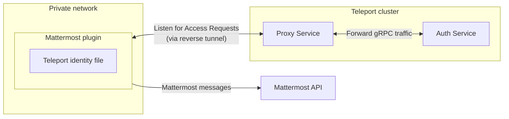

This guide will explain how to set up Teleport with Mattermost, an open source
messaging platform. Teleport's Mattermost notifies individuals of
Access Requests. Users can then approve and deny Access Requests by following the
message link, making it easier to implement security best practices without
compromising productivity.



## Prerequisites

<Tabs>
  <Tab title="Enterprise">
    - A running Teleport Enterprise cluster, including the Auth Service and Proxy Service. For
      details on how to set this up, see our Enterprise [Getting
      Started](/docs/ver/13.x/choose-an-edition/teleport-enterprise/introduction) guide.

    - The Enterprise `tctl` admin tool and `tsh` client tool version >= 13.2.0,
      which you can download by visiting your [Teleport account](https://teleport.sh).

      ```code
      $ tctl version
      # Teleport Enterprise v13.2.0 go1.20

      $ tsh version
      # Teleport v13.2.0 go1.20
      ```
  </Tab>

  <Tab title="Teleport Enterprise Cloud">
    - A Teleport Enterprise Cloud account. If you do not have one, visit the [signup
      page](https://goteleport.com/signup/) to begin a free trial of Teleport Team
      and upgrade to Teleport Enterprise Cloud.

    - The `tctl` admin tool and `tsh` client tool version >= 13.2.0.
      To download these tools, visit the [Downloads](/docs/ver/13.x/choose-an-edition/teleport-cloud/downloads) page.

      ```code
      $ tctl version
      # Teleport Enterprise v13.2.0 go1.20

      $ tsh version
      # Teleport v13.2.0 go1.20
      ```
  </Tab>
</Tabs>

- A Mattermost account with admin privileges. This plugin has been tested with
  Mattermost v7.0.1.
- Either a Linux host or Kubernetes cluster where you will run the Mattermost plugin.
- Make sure you can connect to Teleport. Log in to your cluster using `tsh`, then use `tctl`
  remotely:
  ```code
  $ tsh login --proxy=teleport.example.com --user=email@example.com
  $ tctl status
  # Cluster  teleport.example.com
  # Version  13.2.0
  # CA pin   sha256:abdc1245efgh5678abdc1245efgh5678abdc1245efgh5678abdc1245efgh5678
  ```
  You can run subsequent `tctl` commands in this guide on your local machine.

  For full privileges, you can also run `tctl` commands on your Auth Service host.
  ```code
  $ tsh login --proxy=myinstance.teleport.sh --user=email@example.com
  $ tctl status
  # Cluster  myinstance.teleport.sh
  # Version  13.2.0
  # CA pin   sha256:sha-hash-here
  ```
  You must run subsequent `tctl` commands in this guide on your local machine.

## Step 1/8. Define RBAC resources

Before you set up the Mattermost plugin, you will need to enable Role Access
Requests in the Proxy or Auth Service.

For the purpose of this guide, we will define an `editor-requester` role, which
can request the built-in `editor` role, and an `editor-reviewer` role that can
review requests for the `editor` role.

Create a file called `editor-request-rbac.yaml` with the following content:

```yaml
kind: role
version: v5
metadata:
  name: editor-reviewer
spec:
  allow:
    review_requests:
      roles: ['editor']
---
kind: role
version: v5
metadata:
  name: editor-requester
spec:
  allow:
    request:
      roles: ['editor']
      thresholds:
        - approve: 1
          deny: 1
```

Create the roles you defined:

```code
$ tctl create -f editor-request-rbac.yaml
role 'editor-reviewer' has been created
role 'editor-requester' has been created
```

Allow yourself to review requests by users with the `editor-requester` role by
assigning yourself the `editor-reviewer` role.

Assign the `editor-reviewer` role to your Teleport user by running the following
commands, depending on whether you authenticate as a local Teleport user or via
the `github`, `saml`, or `oidc` authentication connectors:

<Tabs>
  <Tab title="Local User">
    Retrieve your local user's configuration resource:

    ```code
    $ tctl get users/$(tsh status -f json | jq -r '.active.username') > out.yaml
    ```

    Edit `out.yaml`, adding `editor-reviewer` to the list of existing roles:

    ```diff
      roles:
       - access
       - auditor
       - editor
    +  - editor-reviewer
    ```

    Apply your changes:

    ```code
    $ tctl create -f out.yaml
    ```
  </Tab>

  <Tab title="GitHub">
    Retrieve your `github`  configuration resource:

    ```code
    $ tctl get github/github --with-secrets > github.yaml
    ```

    Edit `github.yaml`, adding `editor-reviewer` to the
    `teams_to_roles` section. The team you will map to this role will depend on how
    you have designed your organization's RBAC, but it should be the smallest team
    possible within your organization. This team must also include your user.

    Here is an example:

    ```diff
      teams_to_roles:
        - organization: octocats
          team: admins
          roles:
            - access
    +       - editor-reviewer
    ```

    Apply your changes:

    ```code
    $ tctl create -f github.yaml
    ```

    <Warning>
      Note the `--with-secrets` flag in the `tctl get` command. This adds the value of
      `spec.signing_key_pair.private_key` to `github.yaml`. This is a sensitive value,
      so take precautions when creating this file and remove it after updating the resource.
    </Warning>
  </Tab>

  <Tab title="SAML">
    Retrieve your `saml`  configuration resource:

    ```code
    $ tctl get --with-secrets saml/mysaml > saml.yaml
    ```

    Edit `saml.yaml`, adding `editor-reviewer` to the
    `attributes_to_roles` section. The attribute you will map to this role will
    depend on how you have designed your organization's RBAC, but it should be the
    smallest group possible within your organization. This group must also include
    your user.

    Here is an example:

    ```diff
      attributes_to_roles:
        - name: "groups"
          value: "my-group"
          roles:
            - access
    +       - editor-reviewer
    ```

    Apply your changes:

    ```code
    $ tctl create -f saml.yaml
    ```

    <Warning>
      Note the `--with-secrets` flag in the `tctl get` command. This adds the value of
      `spec.signing_key_pair.private_key` to `saml.yaml`. This is a sensitive value,
      so take precautions when creating this file and remove it after updating the resource.
    </Warning>
  </Tab>

  <Tab title="OIDC">
    Retrieve your `oidc`  configuration resource:

    ```code
    $ tctl get oidc/myoidc --with-secrets > oidc.yaml
    ```

    Edit `oidc.yaml`, adding `editor-reviewer` to the
    `claims_to_roles` section. The claim you will map to this role will depend on
    how you have designed your organization's RBAC, but it should be the smallest
    group possible within your organization. This group must also include your
    user.

    Here is an example:

    ```diff
      claims_to_roles:
        - name: "groups"
          value: "my-group"
          roles:
            - access
    +       - editor-reviewer
    ```

    Apply your changes:

    ```code
    $ tctl create -f oidc.yaml
    ```

    <Warning>
      Note the `--with-secrets` flag in the `tctl get` command. This adds the value of
      `spec.signing_key_pair.private_key` to `oidc.yaml`. This is a sensitive value,
      so take precautions when creating this file and remove it after updating the resource.
    </Warning>
  </Tab>
</Tabs>

Log out of your Teleport cluster and log in again to assume the new role.

Create a user called `myuser` who has the `editor-requester` role. This user
cannot edit your cluster configuration unless they request the `editor` role:

```code
$ tctl users add myuser --roles=editor-requester 
```

`tctl` will print an invitation URL to your terminal. Visit the URL and log in
as `myuser` for the first time, registering credentials as configured for your
Teleport cluster.

Later in this guide, you will have `myuser` request the `editor` role so you can
review the request using the Teleport plugin.

## Step 2/8. Install the Teleport Mattermost plugin

We recommend installing Teleport plugins on the same host as the Teleport Proxy
Service. This is an ideal location as plugins have a low memory footprint, and
will require both public internet access and Teleport Auth Service access.

Install the Teleport Mattermost plugin on a host that can access both your
Teleport Proxy Service and your Mattermost deployment.

<Tabs>
  <Tab title="Download">
    ```code
    $ curl -L -O https://get.gravitational.com/teleport-access-mattermost-v13.2.0-linux-amd64-bin.tar.gz
    $ tar -xzf teleport-access-mattermost-v13.2.0-linux-amd64-bin.tar.gz
    $ cd teleport-access-mattermost
    $ ./install
    ```
  </Tab>

  <Tab title="From Source">
    To install from source you need `git` and `go` installed. If you do not have Go installed, visit the Go [downloads page](https://go.dev/dl/).

    ```code
    # Checkout teleport-plugins
    $ git clone https://github.com/gravitational/teleport-plugins.git
    $ cd teleport-plugins/access/mattermost
    $ make
    ```

    Run `./install` from `teleport-mattermost` or place the executable in the appropriate `/usr/bin` or `/usr/local/bin` on the server installation.
  </Tab>

  <Tab title="Docker">
    ```code
    $ docker pull public.ecr.aws/gravitational/teleport-plugin-mattermost:13.2.0
    ```
  </Tab>

  <Tab title="Helm Chart">
    To allow Helm to install charts that are hosted in the Teleport Helm repository, use `helm repo add`:

    ```code
    $ helm repo add teleport https://charts.releases.teleport.dev
    ```

    To update the cache of charts from the remote repository, run `helm repo update`:

    ```code
    $ helm repo update
    ```
  </Tab>
</Tabs>

## Step 3/8. Create a user and role for the plugin

Teleport's Access Request plugins authenticate to your Teleport cluster as a
user with permissions to list and read Access Requests. This way, plugins can
retrieve Access Requests from the Teleport Auth Service and present them to
reviewers.

Define a user and role called `access-plugin` by adding the following content to
a file called `access-plugin.yaml`:

```yaml
kind: role
version: v5
metadata:
  name: access-plugin
spec:
  allow:
    rules:
      - resources: ['access_request']
        verbs: ['list', 'read']
      - resources: ['access_plugin_data']
        verbs: ['update']
---
kind: user
metadata:
  name: access-plugin
spec:
  roles: ['access-plugin']
version: v2
```

Create the user and role:

```code
$ tctl create -f access-plugin.yaml
```

As with all Teleport users, the Teleport Auth Service authenticates the
`access-plugin` user by issuing short-lived TLS credentials. In this case, we
will need to request the credentials manually by *impersonating* the
`access-plugin` role and user.

If you are using `tctl` from the Auth
Service host, you will already have impersonation privileges.

To grant your user impersonation privileges for `access-plugin`, define a role
called `access-plugin-impersonator` by pasting the following YAML document into
a file called `access-plugin-impersonator.yaml`:

```yaml
kind: role
version: v5
metadata:
  name: access-plugin-impersonator
spec:
  allow:
    impersonate:
      roles:
      - access-plugin
      users:
      - access-plugin
```

Create the `access-plugin-impersonator` role:

```code
$ tctl create -f access-plugin-impersonator.yaml
```

Assign the `access-plugin-impersonator` role to your Teleport user by running the following
commands, depending on whether you authenticate as a local Teleport user or via
the `github`, `saml`, or `oidc` authentication connectors:

<Tabs>
  <Tab title="Local User">
    Retrieve your local user's configuration resource:

    ```code
    $ tctl get users/$(tsh status -f json | jq -r '.active.username') > out.yaml
    ```

    Edit `out.yaml`, adding `access-plugin-impersonator` to the list of existing roles:

    ```diff
      roles:
       - access
       - auditor
       - editor
    +  - access-plugin-impersonator
    ```

    Apply your changes:

    ```code
    $ tctl create -f out.yaml
    ```
  </Tab>

  <Tab title="GitHub">
    Retrieve your `github`  configuration resource:

    ```code
    $ tctl get github/github --with-secrets > github.yaml
    ```

    Edit `github.yaml`, adding `access-plugin-impersonator` to the
    `teams_to_roles` section. The team you will map to this role will depend on how
    you have designed your organization's RBAC, but it should be the smallest team
    possible within your organization. This team must also include your user.

    Here is an example:

    ```diff
      teams_to_roles:
        - organization: octocats
          team: admins
          roles:
            - access
    +       - access-plugin-impersonator
    ```

    Apply your changes:

    ```code
    $ tctl create -f github.yaml
    ```

    <Warning>
      Note the `--with-secrets` flag in the `tctl get` command. This adds the value of
      `spec.signing_key_pair.private_key` to `github.yaml`. This is a sensitive value,
      so take precautions when creating this file and remove it after updating the resource.
    </Warning>
  </Tab>

  <Tab title="SAML">
    Retrieve your `saml`  configuration resource:

    ```code
    $ tctl get --with-secrets saml/mysaml > saml.yaml
    ```

    Edit `saml.yaml`, adding `access-plugin-impersonator` to the
    `attributes_to_roles` section. The attribute you will map to this role will
    depend on how you have designed your organization's RBAC, but it should be the
    smallest group possible within your organization. This group must also include
    your user.

    Here is an example:

    ```diff
      attributes_to_roles:
        - name: "groups"
          value: "my-group"
          roles:
            - access
    +       - access-plugin-impersonator
    ```

    Apply your changes:

    ```code
    $ tctl create -f saml.yaml
    ```

    <Warning>
      Note the `--with-secrets` flag in the `tctl get` command. This adds the value of
      `spec.signing_key_pair.private_key` to `saml.yaml`. This is a sensitive value,
      so take precautions when creating this file and remove it after updating the resource.
    </Warning>
  </Tab>

  <Tab title="OIDC">
    Retrieve your `oidc`  configuration resource:

    ```code
    $ tctl get oidc/myoidc --with-secrets > oidc.yaml
    ```

    Edit `oidc.yaml`, adding `access-plugin-impersonator` to the
    `claims_to_roles` section. The claim you will map to this role will depend on
    how you have designed your organization's RBAC, but it should be the smallest
    group possible within your organization. This group must also include your
    user.

    Here is an example:

    ```diff
      claims_to_roles:
        - name: "groups"
          value: "my-group"
          roles:
            - access
    +       - access-plugin-impersonator
    ```

    Apply your changes:

    ```code
    $ tctl create -f oidc.yaml
    ```

    <Warning>
      Note the `--with-secrets` flag in the `tctl get` command. This adds the value of
      `spec.signing_key_pair.private_key` to `oidc.yaml`. This is a sensitive value,
      so take precautions when creating this file and remove it after updating the resource.
    </Warning>
  </Tab>
</Tabs>

Log out of your Teleport cluster and log in again to assume the new role.

You will now be able to generate signed certificates for the `access-plugin`
role and user.

## Step 4/8. Export the access plugin identity

Like all Teleport users, `access-plugin` needs signed credentials in
order to connect to your Teleport cluster. You will use the `tctl auth sign`
command to request these credentials for your plugin.

The following `tctl auth sign` command impersonates the `access-plugin` user,
generates signed credentials, and writes an identity file to the local
directory:

```code
$ tctl auth sign --user=access-plugin --out=auth.pem
```

The plugin connects to the Teleport Auth Service's gRPC endpoint over TLS.

The identity file, `auth.pem`, includes both TLS and SSH credentials. The plugin
uses the SSH credentials to connect to the Proxy Service, which establishes a
reverse tunnel connection to the Auth Service. The plugin uses this reverse
tunnel, along with your TLS credentials, to connect to the Auth Service's gRPC
endpoint.

You will refer to this file later when configuring the plugin.

<Note>
  By default, `tctl auth sign` produces certificates with a relatively short
  lifetime. For production deployments, we suggest using [Machine
  ID](/docs/ver/13.x/machine-id/introduction) to programmatically issue and renew
  certificates for your plugin. See our Machine ID [getting started
  guide](/docs/ver/13.x/machine-id/getting-started) to learn more.

  Note that you cannot issue certificates that are valid longer than your existing credentials.
  For example, to issue certificates with a 1000-hour TTL, you must be logged in with a session that is
  valid for at least 1000 hours. This means your user must have a role allowing
  a `max_session_ttl` of at least 1000 hours, and you must specify a `--ttl`
  when logging in:

  ```code
  $ tsh login --proxy=teleport.example.com --ttl=1001h
  ```
</Note>

## Step 5/8. Register a Mattermost bot

Now that you have generated the credentials your plugin needs to connect to your
Teleport cluster, register your plugin with Mattermost so it can send Access
Request messages to your workspace.

In Mattermost, click the menu button in the upper left of the UI, then click
System Console → Integrations → Bot Accounts.

Set "Enable Bot Account Creation" to "true".


This will allow you to create a new bot account for the Mattermost plugin.

Go back to your team. In the menu on the upper left of the UI, click
Integrations → Bot Accounts → Add Bot Account.

Set the "Username", "Display Name", and "Description" fields according to how
you would like the Mattermost plugin bot to appear in your workspace. Set "Role"
to "Member".

You can <a href="/assets/teleport_bot@2x-8b9736129a.png" download>download</a> our avatar to set as your Bot Icon.

Set "post:all" to "Enabled".


Click "Create Bot Account". We will use the resulting OAuth 2.0 token when we
configure the Mattermost plugin.

## Step 6/8. Configure the Mattermost plugin

At this point, you have generated credentials that the Mattermost plugin will use
to connect to Teleport and Mattermost. You will now configure the Mattermost
plugin to use these credentials and post messages in the right channels for your
workspace.

<Tabs>
  <Tab title="Executable">
    The Mattermost plugin uses a config file in TOML format. On the host where you
    will run the Mattermost plugin, generate a boilerplate config by running the
    following commands:

    ```code
    $ teleport-mattermost configure > teleport-mattermost.toml
    $ sudo mv teleport-mattermost.toml /etc
    ```
  </Tab>

  <Tab title="Helm Chart">
    The Mattermost Helm Chart uses a YAML values file to configure the plugin. On
    the host where you have Helm installed, create a file called
    `teleport-mattermost-helm.yaml` based on the following example:

    ```yaml
    teleport:
      # Teleport HTTPS Proxy web address, for Teleport Enterprise Cloud should be in the form "your-account.teleport.sh:443"
      address: "teleport.example.com:443"
      # Secret containing identity
      identitySecretName: teleport-plugin-mattermost-identity

    mattermost:
      url: https://mattermost.example.com/  # URL of the Mattermost instance
      token: mattermosttoken                # Mattermost token of the bot
      recipients:
        - "access-requests@example.com"     # User
        - "team/example-channel"            # Channel

    log:
      output: "stderr" # Logger output. Could be "stdout", "stderr" or "/var/lib/teleport/mattermost.log"
      severity: "INFO" # Logger severity. Could be "INFO", "ERROR", "DEBUG" or "WARN".

    ```
  </Tab>
</Tabs>

Edit the configuration as explained below:

### `[teleport]`

<Tabs>
  <Tab title="Executable">
    **`addr`**: Include the hostname and HTTPS port of your Teleport Proxy Service
    or Teleport Enterprise Cloud tenant (e.g., `teleport.example.com:443` or
    `mytenant.teleport.sh:443`).

    **`identity`**: Fill this in with the path to the identity file you exported
    earlier.

    **`client_key`**, **`client_crt`**, **`root_cas`**: Comment these out, since we
    are not using them in this configuration.
  </Tab>

  <Tab title="Helm Chart">
    **`address`**: Include the hostname and HTTPS port of your Teleport Proxy Service
    or Teleport Enterprise Cloud tenant (e.g., `teleport.example.com:443` or
    `mytenant.teleport.sh:443`).

    **`identitySecretName`**: Fill in the `identitySecretName` field with the name
    of the Kubernetes secret you created earlier.
  </Tab>
</Tabs>

### `[mattermost]`

<Tabs>
  <Tab title="Executable">
    **`url`**: Include the scheme (`https://`) and fully qualified domain name of
    your Mattermost deployment.

    **`token`**: Find your Mattermost bot's OAuth 2.0 token. To do so, visit
    Mattermost. In the menu on the upper left of the UI, go to Integrations → Bot
    Accounts. Find the listing for the Teleport plugin and click "Create New Token".
    After you save the token, you will see a message with text in the format,
    "Access Token: TOKEN". Copy the token and paste it here.

    **`recipients`**: This field configures the channels that the Mattermost plugin
    will notify when it receives an Access Request message. The value is an array of
    strings, where each element is either:

    - The email address of a Mattermost user to notify via a direct message when the
      plugin receives an Access Request event
    - A channel name in the format `team/channel`, where `/` separates the name
      of the team and the name of the channel

    For example, this configuration will notify `first.last@example.com` and
    the `Town Square` channel in the `myteam` team of any Access Request events:

    ```toml
    recipients = [
      "myteam/Town Square",
      "first.last@example.com"
    ]
    ```
  </Tab>

  <Tab title="Helm Chart">
    **`url`**: Include the scheme (`https://`) and fully qualified domain name of
    your Mattermost deployment.

    **`token`**: Find your Mattermost bot's OAuth 2.0 token. To do so, visit
    Mattermost. In the menu on the upper left of the UI, go to Integrations → Bot
    Accounts. Find the listing for the Teleport plugin and click "Create New Token".
    After you save the token, you will see a message with text in the format,
    "Access Token: TOKEN". Copy the token and paste it here.

    **`recipients`**: This field configures the channels that the Mattermost plugin
    will notify when it receives an Access Request message. The value is an array of
    strings, where each element is either:

    - The email address of a Mattermost user to notify via a direct message when the
      plugin receives an Access Request event
    - A channel name in the format `team/channel`, where `/` separates the name
      of the team and the name of the channel

    For example, this configuration will notify `first.last@example.com` and
    the `Town Square` channel in the `myteam` team of any Access Request events:

    ```yaml
    recipients:
      - "myteam/Town Square"
      - first.last@example.com
    ```
  </Tab>
</Tabs>

You will need to invite your Teleport plugin to any channel you add to the
`recipients` list (aside from direct message channels). Visit Mattermost,
navigate to each channel you want to invite the plugin to, and enter `/invite
@teleport` (or the name of the bot you configured) into the message box.


<Accordion title="Suggested reviewers">
  Users can also suggest reviewers when they create an Access Request, e.g.,:

  ```code
  $ tsh request create --roles=dbadmin --reviewers=alice@example.com,ivan@example.com
  ```

  If an Access Request includes suggested reviewers, the Mattermost plugin will
  add these to the list of channels to notify. If a suggested reviewer is an email
  address, the plugin will look up the the direct message channel for that address
  and post a message in that channel.

  If `recipients` is empty, and the user requesting elevated privileges has not
  suggested any reviewers, the plugin will skip forwarding the Access Request to
  Mattermost.
</Accordion>

The final configuration should look similar to this:

<Tabs>
  <Tab title="Executable">
    ```yaml
    # example mattermost configuration TOML file
    [teleport]
    auth_server = "myinstance.teleport.sh:443"                   # Teleport Cloud proxy HTTPS address
    identity = "/var/lib/teleport/plugins/mattermost/auth.pem"   # Identity file path

    [mattermost]
    url = "https://mattermost.example.com" # Mattermost Server URL
    token = "api-token"                    # Mattermost Bot OAuth token
    recipients = [
      "myteam/general",
      "first.last@example.com"
    ]

    [log]
    output = "stderr" # Logger output. Could be "stdout", "stderr" or "/var/lib/teleport/mattermost.log"
    severity = "INFO" # Logger severity. Could be "INFO", "ERROR", "DEBUG" or "WARN".

    ```
  </Tab>

  <Tab title="Helm Chart">
    ```yaml
    teleport:
      # Teleport HTTPS Proxy web address, for Teleport Enterprise Cloud should be in the form "your-account.teleport.sh:443"
      address: "teleport.example.com:443"
      # Secret containing identity
      identitySecretName: teleport-plugin-mattermost-identity

    mattermost:
      url: https://mattermost.example.com/  # URL of the Mattermost instance
      token: mattermosttoken                # Mattermost token of the bot
      recipients:
        - "access-requests@example.com"     # User
        - "team/example-channel"            # Channel

    log:
      output: "stderr" # Logger output. Could be "stdout", "stderr" or "/var/lib/teleport/mattermost.log"
      severity: "INFO" # Logger severity. Could be "INFO", "ERROR", "DEBUG" or "WARN".

    ```
  </Tab>
</Tabs>

## Step 7/8. Test your Mattermost bot

<Tabs>
  <Tab title="Executable">
    After modifying your configuration, run the bot with the following command:

    ```code
    $ teleport-mattermost start -d
    ```

    The `-d` flag provides debug information to make sure the bot can connect to
    Mattermost, e.g.:

    ```text
    DEBU   Checking Teleport server version mattermost/main.go:234
    DEBU   Starting a request watcher... mattermost/main.go:296
    DEBU   Starting Mattermost API health check... mattermost/main.go:186
    DEBU   Starting secure HTTPS server on :8081 utils/http.go:146
    DEBU   Watcher connected mattermost/main.go:260
    DEBU   Mattermost API health check finished ok mattermost/main.go:19
    ```
  </Tab>

  <Tab title="Helm Chart">
    After modifying your configuration, run the bot with the following command:

    ```code
    $ helm upgrade --install teleport-plugin-mattermost teleport/teleport-plugin-mattermost --values teleport-mattermost-helm.yaml
    ```

    To inspect the plugin's logs, use the following command:

    ```code
    $ kubectl logs deploy/teleport-plugin-mattermost
    ```

    Debug logs can be enabled by setting `log.severity` to `DEBUG` in
    `teleport-mattermost-helm.yaml` and executing the `helm upgrade ...` command
    above again. Then you can restart the plugin with the following command:

    ```code
    $ kubectl rollout restart deployment teleport-plugin-mattermost
    ```
  </Tab>
</Tabs>

### Create an Access Request

<Tabs>
  <Tab title="As an Admin">
    A Teleport admin can create an Access Request for another user with `tctl`:

    ```code
    $ tctl request create myuser --roles=editor
    ```
  </Tab>

  <Tab title="As a User">
    Users can use `tsh` to create an Access Request and log in with approved roles:

    ```code
    $ tsh request create --roles=editor
    Seeking request approval... (id: 8f77d2d1-2bbf-4031-a300-58926237a807)
    ```
  </Tab>

  <Tab title="From the Web UI">
    Users can request access using the Web UI by visiting the "Access Requests"
    tab and clicking "New Request":

    
  </Tab>
</Tabs>

The users and channels you configured earlier to review the request should
receive a message from "Teleport" in Mattermost allowing them to visit a link in
the Teleport Web UI and either approve or deny the request.

### Resolve the request

Once you receive an Access Request message, click the link to visit Teleport and
approve or deny the request:


<Accordion title="Reviewing from the command line">
  You can also review an Access Request from the command line:

  <Tabs>
    <Tab title="As an Admin">
      ```code
      # Replace REQUEST_ID with the id of the request
      $ tctl request approve REQUEST_ID
      $ tctl request deny REQUEST_ID
      ```
    </Tab>

    <Tab title="As a User">
      ```code
      # Replace REQUEST_ID with the id of the request
      $ tsh request review --approve REQUEST_ID
      $ tsh request review --deny REQUEST_ID
      ```
    </Tab>
  </Tabs>
</Accordion>

<Note>
  When the Mattermost plugin posts an Access Request notification to a channel,
  anyone with access to the channel can view the notification and follow the link.
  While users must be authorized via their Teleport roles to review Access
  Requests, you should still check the Teleport audit log to ensure that the right
  users are reviewing the right requests.

  When auditing Access Request reviews, check for events with the type `Access
  Request Reviewed` in the Teleport Web UI and `access_request.review` if reviewing the audit log on the
  Auth Service host.
</Note>

## Step 8/8. Set up systemd

In production, we recommend starting the Teleport plugin daemon via an init
system like systemd. Here's the recommended Teleport plugin service unit file
for systemd:

```ini
[Unit]
Description=Teleport Mattermost Plugin
After=network.target

[Service]
Type=simple
Restart=on-failure
ExecStart=/usr/local/bin/teleport-mattermost start --config=/etc/teleport-mattermost.toml
ExecReload=/bin/kill -HUP $MAINPID
PIDFile=/run/teleport-mattermost.pid

[Install]
WantedBy=multi-user.target
```

Save this as `teleport-mattermost.service` in either `/usr/lib/systemd/system/` or
another [unit file load
path](https://www.freedesktop.org/software/systemd/man/systemd.unit.html#Unit%20File%20Load%20Path)
supported by systemd.

Enable and start the plugin:

```code
$ sudo systemctl enable teleport-mattermost
$ sudo systemctl start teleport-mattermost
```

## Feedback

If you have any issues with this plugin, please create an [issue
on GitHub](https://github.com/gravitational/teleport-plugins/issues/new).
