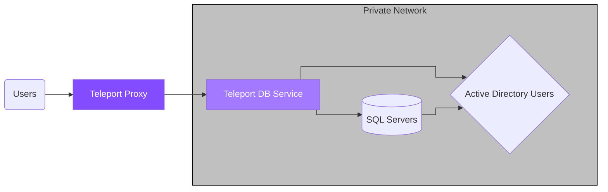
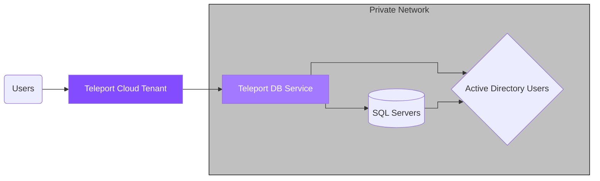

This guide will help you to:

- Install and configure Teleport.
- Set up access to SQL Server using Active Directory authentication.
- Connect to SQL Server through Teleport.





This guide will focus on Amazon RDS for SQL Server using AWS-managed Active
Directory authentication.

## Prerequisites

<Tabs>
  <Tab title="Teleport Team">
    - A Teleport Team account. If you do not have one, visit the [signup
      page](https://goteleport.com/signup/) to begin your free trial.

    - The `tctl` admin tool and `tsh` client tool version >= 14.0.0-dev.

      ```code
      $ tctl version
      # Teleport v14.0.0-dev go1.20

      $ tsh version
      # Teleport v14.0.0-dev go1.20
      ```

      See [Installation](/docs/ver/14.x/installation) for details.
  </Tab>

  <Tab title="Teleport Community Edition">
    - A running Teleport cluster. For details on how to set this up, see our
      [Getting Started](/docs/ver/14.x/index) guide.

    - The `tctl` admin tool and `tsh` client tool version >= 14.0.0-dev.

      ```code
      $ tctl version
      # Teleport v14.0.0-dev go1.20

      $ tsh version
      # Teleport v14.0.0-dev go1.20
      ```

      See [Installation](/docs/ver/14.x/installation) for details.
  </Tab>

  <Tab title="Teleport Enterprise">
    - A running Teleport Enterprise cluster. For details on how to set this up, see our Enterprise
      [Getting Started](/docs/ver/14.x/choose-an-edition/teleport-enterprise/introduction) guide.

    - The Enterprise `tctl` admin tool and `tsh` client tool version >= 14.0.0-dev,
      which you can download by visiting your [Teleport account](https://teleport.sh).

      ```code
      $ tctl version
      # Teleport Enterprise v14.0.0-dev go1.20

      $ tsh version
      # Teleport v14.0.0-dev go1.20
      ```
  </Tab>

  <Tab title="Teleport Enterprise Cloud">
    - A Teleport Enterprise Cloud account. If you do not have one, visit the [signup
      page](https://goteleport.com/signup/) to begin a free trial of Teleport Team
      and upgrade to Teleport Enterprise Cloud.

    - The Enterprise `tctl` admin tool and `tsh` client tool version >= 13.2.0.
      To download these tools, visit the [Downloads](/docs/ver/14.x/choose-an-edition/teleport-cloud/downloads) page.

      ```code
      $ tctl version
      # Teleport Enterprise v13.2.0 go1.20

      $ tsh version
      # Teleport v13.2.0 go1.20
      ```
  </Tab>
</Tabs>

- A SQL Server database with Active Directory authentication enabled.
- A SQL Server network listener configured with a Certificate using Subject Alternative Names
- A Windows machine joined to the same Active Directory domain as the database.
- A Linux node joined to the same Active Directory domain as the database. This
  guide will walk you through the joining steps if you don't have one.
- Make sure you can connect to Teleport. Log in to your cluster using `tsh`, then use `tctl`
  remotely:
  {/* Ignoring scope linting since we use this partial throughout the docs and
  cannot guarantee that it will line up with a page's configured scopes*/}
  {/*lint ignore scopes*/}
  ```code
  $ tsh login --proxy=teleport.example.com --user=email@example.com
  $ tctl status
  # Cluster  teleport.example.com
  # Version  14.0.0-dev
  # CA pin   sha256:abdc1245efgh5678abdc1245efgh5678abdc1245efgh5678abdc1245efgh5678
  ```
  You can run subsequent `tctl` commands in this guide on your local machine.

  For full privileges, you can also run `tctl` commands on your Auth Service host.
  {/*lint ignore scopes*/}
  ```code
  $ tsh login --proxy=myinstance.teleport.sh --user=email@example.com
  $ tctl status
  # Cluster  myinstance.teleport.sh
  # Version  13.2.0
  # CA pin   sha256:sha-hash-here
  ```
  You must run subsequent `tctl` commands in this guide on your local machine.

## Step 1/7. Create a Teleport user

<Tip>
  To modify an existing user to provide access to the Database Service, see [Database Access Access Controls](/docs/ver/14.x/database-access/rbac)
</Tip>

<Tabs>
  <Tab title="Teleport Team/Community Edition">
    Create a local Teleport user with the built-in `access` role:

    ```code
    $ tctl users add \
      --roles=access \
      --db-users=\* \
      --db-names=\* \
      alice
    ```
  </Tab>

  <Tab title="Teleport Enterprise/Enterprise Cloud">
    Create a local Teleport user with the built-in `access` and `requester` roles:

    ```code
    $ tctl users add \
      --roles=access,requester \
      --db-users=\* \
      --db-names=\* \
      alice
    ```
  </Tab>
</Tabs>

| Flag         | Description                                                                                                                              |
| ------------ | ---------------------------------------------------------------------------------------------------------------------------------------- |
| `--roles`    | List of roles to assign to the user. The builtin `access` role allows them to connect to any database server registered with Teleport.   |
| `--db-users` | List of database usernames the user will be allowed to use when connecting to the databases. A wildcard allows any user.                 |
| `--db-names` | List of logical databases (aka schemas) the user will be allowed to connect to within a database server. A wildcard allows any database. |

<Warning>
  Database names are only enforced for PostgreSQL and MongoDB databases.
</Warning>

For more detailed information about database access controls and how to restrict
access see [RBAC](/docs/ver/14.x/database-access/rbac) documentation.

## Step 2/7. Join the Linux node to Active Directory

<Note>
  You can skip this step if you already have a Linux node joined to the same
  Active Directory domain as your SQL Server instance.
</Note>

The Linux node where the Database Service will run must be joined to the same
Active Directory domain as the SQL Server database.

Note that in order to be able to join, the Linux node must be able to resolve
your Active Directory fully-qualified domain name. For example, for AWS-managed
AD, use nameservers provided under "Networking details" on the directory's
overview page.

Install necessary packages:

<Tabs>
  <Tab title="Ubuntu">
    ```code
    $ sudo apt-get update
    $ sudo apt-get -y install sssd realmd krb5-user samba-common packagekit adcli
    ```
  </Tab>

  <Tab title="RHEL / CentOS 7">
    ```code
    $ sudo yum -y update
    $ sudo yum -y install sssd realmd krb5-workstation samba-common-tools
    ```
  </Tab>
</Tabs>

Edit `/etc/krb5.conf` to disable reverse DNS resolution and set the default
realm. Make sure that the `[realms]` section contains your domain definition
and has `admin_server` and `kdc` fields set pointing to the domain controllers:

```ini
[libdefaults]
default_realm = EXAMPLE.COM
rdns = false

[realms]
  EXAMPLE.COM = {
    kdc = example.com
    admin_server = example.com
  }
```

Join the realm:

```code
$ sudo realm join -v -U admin@EXAMPLE.COM example.com
...
 * Successfully enrolled machine in realm
```

<Warning>
  Note that the realm name in `admin@EXAMPLE.COM` **must** be capital case,
  otherwise the node might not be able to join.
</Warning>

To confirm the node has joined the realm, use the `realm list` command:

```code
$ sudo realm list
example.com
  type: kerberos
  realm-name: EXAMPLE.COM
  domain-name: example.com
  configured: kerberos-member
  server-software: active-directory
  client-software: sssd
  ...
```

## Step 3/7. Create keytab file

Teleport requires a keytab file to obtain Kerberos service tickets from your
Active Directory for authentication with SQL Server. The easiest way to generate
it is to use the `adutil` Linux CLI utility.

Install `adutil` on the Linux node you have joined to your Active Directory
domain:

<Tabs>
  <Tab title="Ubuntu 18.04">
    ```code
    $ curl https://packages.microsoft.com/keys/microsoft.asc | sudo apt-key add -
    $ sudo curl https://packages.microsoft.com/config/ubuntu/18.04/prod.list | sudo tee /etc/apt/sources.list.d/msprod.list
    $ sudo apt-get update
    $ sudo ACCEPT_EULA=Y apt-get install -y adutil
    ```
  </Tab>

  <Tab title="Ubuntu 20.04">
    ```code
    $ sudo wget -qO /etc/apt/trusted.gpg.d/microsoft.asc https://packages.microsoft.com/keys/microsoft.asc
    $ sudo curl https://packages.microsoft.com/config/ubuntu/20.04/prod.list | sudo tee /etc/apt/sources.list.d/msprod.list
    $ sudo apt-get update
    $ sudo ACCEPT_EULA=Y apt-get install -y adutil
    ```
  </Tab>

  <Tab title="RHEL / CentOS 7">
    ```code
    $ sudo curl -o /etc/yum.repos.d/msprod.repo https://packages.microsoft.com/config/rhel/8/prod.repo
    $ sudo ACCEPT_EULA=Y yum install -y adutil
    ```
  </Tab>
</Tabs>

Log in to Active Directory using the `kinit` command:

```code
$ kinit admin@EXAMPLE.COM
```

Use the `adutil keytab create` command to generate keytab entries for each
Active Directory user that will be connecting to the SQL Server database:

```code
$ adutil keytab create teleport.keytab alice
$ adutil keytab create teleport.keytab bob
```

You will be prompted to enter each user's password. All keytab entries will
be merged into the same `teleport.keytab` file.

<Note>
  For the `adutil keytab create` command to work, each user account must be
  assigned a Service Principal Name, otherwise the command will not be able
  to determine its `kvno` (key version number).

  To check if the user has any SPNs assigned, run the following command on the
  Windows machine joined to your Active Directory domain:

  ```code
  $ setspn -L alice
  ```

  To assign an SPN to a user account, use the following command:

  ```code
  $ setspn -s user/alice alice
  ```
</Note>

You can verify entries in the keytab file using `klist` command:

```code
$ klist -ke teleport.keytab
Keytab name: FILE:teleport.keytab
KVNO Principal
---- --------------------------------------------------------------------------
   5 alice@EXAMPLE.COM (aes256-cts-hmac-sha1-96)
   2 bob@EXAMPLE.COM (aes256-cts-hmac-sha1-96)
```

<Warning>
  You must update the keytab file after updating a user's password to avoid
  authentication failures.
</Warning>

## Step 4/7. Set up the Teleport Database Service

The Database Service requires a valid auth token to connect to the cluster. Generate
one by running the following command against your Teleport Auth Service and save
it in `/tmp/token` on the node that will run the Database Service:

```code
$ tctl tokens add --type=db
```

Install Teleport on the host where you will run the Teleport Database Service:

Use the appropriate commands for your environment to install your package:

<Tabs dropdownView dropdownCaption="Teleport Edition">
  <Tab title="Teleport Team">
    ```code
    $ curl https://goteleport.com/static/install.sh | bash -s 13.2.0
    ```

    <Accordion title="Is my Teleport instance compatible with Teleport Team?">
      Before installing a `teleport` binary with a version besides
      v13, read our compatibility rules to ensure that the
      binary is compatible with Teleport Cloud.

      When running multiple `teleport` binaries within a cluster, the following rules
      apply:

      - **Patch and minor** versions are always compatible, for example, any 8.0.1
        component will work with any 8.0.3 component and any 8.1.0 component will work
        with any 8.3.0 component.
      - Servers support clients that are 1 major version behind, but do not support
        clients that are on a newer major version. For example, an 8.x.x Proxy Service
        is compatible with 7.x.x resource services and 7.x.x `tsh`, but we don't
        guarantee that a 9.x.x resource service will work with an 8.x.x Proxy Service.
        This also means you must not attempt to upgrade from 6.x.x straight to 8.x.x.
        You must upgrade to 7.x.x first.
      - Proxy Services and resource services do not support Auth Services that are on
        an older major version, and will fail to connect to older Auth Services by
        default. This behavior can be overridden by passing `--skip-version-check`
        when starting Proxy Services and resource services.
    </Accordion>
  </Tab>

  <Tab title="Open Source">
    ```code
    $ curl https://goteleport.com/static/install.sh | bash -s 14.0.0-dev
    ```
  </Tab>

  <Tab title="Enterprise">
    <Tabs>
      <Tab title="Debian 8+/Ubuntu 16.04+ (apt)">
        ```code
        # Download Teleport's PGP public key
        $ sudo curl https://apt.releases.teleport.dev/gpg \
        -o /usr/share/keyrings/teleport-archive-keyring.asc
        # Source variables about OS version
        $ source /etc/os-release
        # Add the Teleport APT repository for v14. You'll need to update this
        # file for each major release of Teleport.
        $ echo "deb [signed-by=/usr/share/keyrings/teleport-archive-keyring.asc] \
        https://apt.releases.teleport.dev/${ID?} ${VERSION_CODENAME?} stable/v14" \
        | sudo tee /etc/apt/sources.list.d/teleport.list > /dev/null

        $ sudo apt-get update
        $ sudo apt-get install teleport-ent
        ```

        For FedRAMP/FIPS-compliant installations, install the `teleport-ent-fips` package instead:

        ```code
        $ sudo apt-get install teleport-ent-fips
        ```
      </Tab>

      <Tab title="Amazon Linux 2/RHEL 7 (yum)">
        ```code
        # Source variables about OS version
        $ source /etc/os-release
        # Add the Teleport YUM repository for v14. You'll need to update this
        # file for each major release of Teleport.
        # First, get the major version from $VERSION_ID so this fetches the correct
        # package version.
        $ VERSION_ID=$(echo $VERSION_ID | grep -Eo "^[0-9]+")
        $ sudo yum-config-manager --add-repo "$(rpm --eval "https://yum.releases.teleport.dev/$ID/$VERSION_ID/Teleport/%{_arch}/stable/v14/teleport.repo")"
        $ sudo yum install teleport-ent
        #
        # Tip: Add /usr/local/bin to path used by sudo (so 'sudo tctl users add' will work as per the docs)
        # echo "Defaults    secure_path = /sbin:/bin:/usr/sbin:/usr/bin:/usr/local/bin" > /etc/sudoers.d/secure_path
        ```

        For FedRAMP/FIPS-compliant installations, install the `teleport-ent-fips` package instead:

        ```code
        $ sudo yum install teleport-ent-fips
        ```
      </Tab>

      <Tab title="Amazon Linux 2023/RHEL 8+ (dnf)">
        ```code
        # Source variables about OS version
        $ source /etc/os-release
        # Add the Teleport YUM repository for v14. You'll need to update this
        # file for each major release of Teleport.
        # Use the dnf config manager plugin to add the teleport RPM repo
        $ sudo dnf config-manager --add-repo "$(rpm --eval "https://yum.releases.teleport.dev/$ID/$VERSION_ID/Teleport/%{_arch}/stable/v14/teleport.repo")"

        # Install teleport
        $ sudo dnf install teleport-ent

        # Tip: Add /usr/local/bin to path used by sudo (so 'sudo tctl users add' will work as per the docs)
        # echo "Defaults    secure_path = /sbin:/bin:/usr/sbin:/usr/bin:/usr/local/bin" > /etc/sudoers.d/secure_path
        ```

        For FedRAMP/FIPS-compliant installations, install the `teleport-ent-fips` package instead:

        ```code
        $ sudo dnf install teleport-ent-fips
        ```
      </Tab>

      <Tab title="Tarball">
        In the example commands below, update `$SYSTEM_ARCH` with the appropriate
        value (`amd64`, `arm64`, or `arm`). All example commands using this variable
        will update after one is filled out.

        ```code
        $ curl https://get.gravitational.com/teleport-ent-v14.0.0-dev-linux-$SYSTEM_ARCH-bin.tar.gz.sha256
        # <checksum> <filename>
        $ curl -O https://cdn.teleport.dev/teleport-ent-v14.0.0-dev-linux-$SYSTEM_ARCH-bin.tar.gz
        $ shasum -a 256 teleport-ent-v14.0.0-dev-linux-$SYSTEM_ARCH-bin.tar.gz
        # Verify that the checksums match
        $ tar -xvf teleport-ent-v14.0.0-dev-linux-$SYSTEM_ARCH-bin.tar.gz
        $ cd teleport-ent
        $ sudo ./install
        ```

        For FedRAMP/FIPS-compliant installations of Teleport Enterprise, package URLs
        will be slightly different:

        ```code
        $ curl https://get.gravitational.com/teleport-ent-v14.0.0-dev-linux-$SYSTEM_ARCH-fips-bin.tar.gz.sha256
        # <checksum> <filename>
        $ curl -O https://cdn.teleport.dev/teleport-ent-v14.0.0-dev-linux-$SYSTEM_ARCH-fips-bin.tar.gz
        $ shasum -a 256 teleport-ent-v14.0.0-dev-linux-$SYSTEM_ARCH-fips-bin.tar.gz
        # Verify that the checksums match
        $ tar -xvf teleport-ent-v14.0.0-dev-linux-$SYSTEM_ARCH-fips-bin.tar.gz
        $ cd teleport-ent
        $ sudo ./install
        ```
      </Tab>
    </Tabs>
  </Tab>

  <Tab title="Enterprise Cloud">
    <Tabs>
      <Tab title="Debian 8+/Ubuntu 16.04+ (apt)">
        Add the Teleport repository to your repository list:

        ```code
        # Download Teleport's PGP public key
        $ sudo curl https://apt.releases.teleport.dev/gpg \
        -o /usr/share/keyrings/teleport-archive-keyring.asc
        # Source variables about OS version
        $ source /etc/os-release
        # Add the Teleport apt repository for cloud.
        $ echo "deb [signed-by=/usr/share/keyrings/teleport-archive-keyring.asc] \
        https://apt.releases.teleport.dev/${ID?} ${VERSION_CODENAME?} stable/cloud" \
        | sudo tee /etc/apt/sources.list.d/teleport.list > /dev/null

        $ sudo apt-get update
        $ sudo apt-get install teleport-ent
        ```
      </Tab>

      <Tab title="Amazon Linux 2/RHEL 7 (yum)">
        ```code
        # Source variables about OS version
        $ source /etc/os-release
        # Add the Teleport yum repository for cloud.
        # First, get the major version from $VERSION_ID so this fetches the correct
        # package version.
        $ VERSION_ID=$(echo $VERSION_ID | grep -Eo "^[0-9]+")
        $ sudo yum-config-manager --add-repo "$(rpm --eval "https://yum.releases.teleport.dev/$ID/$VERSION_ID/Teleport/%{_arch}/stable/cloud/teleport.repo")"
        $ sudo yum install teleport-ent
        #
        # Tip: Add /usr/local/bin to path used by sudo (so 'sudo tctl users add' will work as per the docs)
        # echo "Defaults    secure_path = /sbin:/bin:/usr/sbin:/usr/bin:/usr/local/bin" > /etc/sudoers.d/secure_path
        ```
      </Tab>

      <Tab title="Amazon Linux 2023/RHEL 8+ (dnf)">
        ```code
        # Source variables about OS version
        $ source /etc/os-release
        # Add the Teleport yum repository for cloud.
        # Use the dnf config manager plugin to add the teleport RPM repo
        $ sudo dnf config-manager --add-repo "$(rpm --eval "https://yum.releases.teleport.dev/$ID/$VERSION_ID/Teleport/%{_arch}/stable/cloud/teleport.repo")"

        # Install teleport
        $ sudo dnf install teleport-ent

        # Tip: Add /usr/local/bin to path used by sudo (so 'sudo tctl users add' will work as per the docs)
        # echo "Defaults    secure_path = /sbin:/bin:/usr/sbin:/usr/bin:/usr/local/bin" > /etc/sudoers.d/secure_path
        ```
      </Tab>

      <Tab title="Tarball">
        In the example commands below, update `$SYSTEM_ARCH` with the appropriate
        value (`amd64`, `arm64`, or `arm`). All example commands using this variable
        will update after one is filled out.

        ```code
        $ curl https://get.gravitational.com/teleport-ent-v13.2.0-linux-$SYSTEM_ARCH-bin.tar.gz.sha256
        # <checksum> <filename>
        $ curl -O https://cdn.teleport.dev/teleport-ent-v13.2.0-linux-amd64-bin.tar.gz
        $ shasum -a 256 teleport-ent-v13.2.0-linux-amd64-bin.tar.gz
        # Verify that the checksums match
        $ tar -xvf teleport-ent-v13.2.0-linux-amd64-bin.tar.gz
        $ cd teleport-ent
        $ sudo ./install
        ```
      </Tab>
    </Tabs>

    <Accordion title="Is my Teleport instance compatible with Teleport Enterprise Cloud?">
      Before installing a `teleport` binary with a version besides v13,
      read our compatibility rules to ensure that the binary is compatible with
      Teleport Enterprise Cloud.

      When running multiple `teleport` binaries within a cluster, the following rules
      apply:

      - **Patch and minor** versions are always compatible, for example, any 8.0.1
        component will work with any 8.0.3 component and any 8.1.0 component will work
        with any 8.3.0 component.
      - Servers support clients that are 1 major version behind, but do not support
        clients that are on a newer major version. For example, an 8.x.x Proxy Service
        is compatible with 7.x.x resource services and 7.x.x `tsh`, but we don't
        guarantee that a 9.x.x resource service will work with an 8.x.x Proxy Service.
        This also means you must not attempt to upgrade from 6.x.x straight to 8.x.x.
        You must upgrade to 7.x.x first.
      - Proxy Services and resource services do not support Auth Services that are on
        an older major version, and will fail to connect to older Auth Services by
        default. This behavior can be overridden by passing `--skip-version-check`
        when starting Proxy Services and resource services.
    </Accordion>
  </Tab>
</Tabs>

<Note>
  Teleport Database Service must run on a Linux server joined to the same
  Active Directory domain as the SQL Server.
</Note>

Configure the Teleport Database Service. Make sure to update `--proxy` to
point to your Teleport Proxy Service address and `--uri` to the SQL Server
endpoint.

```code
$ sudo teleport db configure create \
  -o file \
  --token=/tmp/token \
  --proxy=teleport.example.com:443 \
  --name=sqlserver \
  --protocol=sqlserver \
  --uri=sqlserver.example.com:1433 \
  --ad-keytab-file=/path/to/teleport.keytab \
  --ad-domain=EXAMPLE.COM \
  --ad-spn=MSSQLSvc/sqlserver.example.com:1433 \
  --labels=env=dev
```

Configure the Teleport Database Service. Make sure to update `--proxy` to
point to your Teleport Cloud tenant address and `--uri` to the SQL Server
endpoint.

```code
$ sudo teleport db configure create \
  -o file \
  --token=/tmp/token \
  --proxy=mytenant.teleport.sh:443 \
  --name=sqlserver \
  --protocol=sqlserver \
  --uri=sqlserver.example.com:1433 \
  --ad-keytab-file=/path/to/teleport.keytab \
  --ad-domain=EXAMPLE.COM \
  --ad-spn=MSSQLSvc/sqlserver.example.com:1433 \
  --labels=env=dev
```

Provide Active Directory parameters:

| Flag               | Description                                                          |
| ------------------ | -------------------------------------------------------------------- |
| `--ad-keytab-file` | Path to Kerberos keytab file generated above.                        |
| `--ad-domain`      | Active Directory domain (Kerberos realm) that SQL Server is joined.  |
| `--ad-spn`         | Service Principal Name for SQL Server to fetch Kerberos tickets for. |

### Service Principal Name

You can use `ldapsearch` command to see the SPNs registered for your SQL
Server. Typically, they take a form of `MSSQLSvc/<name>.<ad-domain>:<port>`.

For example, an AWS RDS SQL Server named `sqlserver` and joined to an AWS managed
Active Directory domain `EXAMPLE.COM` will have the following SPNs registered:

```code
$ ldapsearch -x -h example.com -D admin -W -b DC=example,DC=com servicePrincipalName
...
# EC2AMAZ-4KN05DU, RDS, AWS Reserved, example.com
dn: CN=EC2AMAZ-4KN05DU,OU=RDS,OU=AWS Reserved,DC=example,DC=com
servicePrincipalName: MSSQLSvc/sqlserver-rds.example.com:1433
servicePrincipalName: MSSQLSvc/EC2AMAZ-4KN05DU.example.com:1433
servicePrincipalName: MSSQLSvc/EC2AMAZ-4KN05DU.example.com
...
```

Alternatively, you can look SPNs up in the Attribute Editor of the Active Directory
Users and Computers dialog on your AD-joined Windows machine. The RDS SQL Server
object typically resides under the AWS Reserved / RDS path:


<Tip>
  If you don't see Attribute Editor tab, make sure that "View > Advanced Features"
  toggle is enabled.
</Tip>

## Step 5/7. Start the Database Service

Configure the Teleport Database Service to start automatically when the host boots up by
creating a systemd service for it. The instructions depend on how you installed
the Teleport Database Service.

<Tabs>
  <Tab title="Package Manager">
    On the host where you will run the Teleport Database Service, enable and start Teleport:

    ```code
    $ sudo systemctl enable teleport
    $ sudo systemctl start teleport
    ```
  </Tab>

  <Tab title="TAR Archive">
    On the host where you will run the Teleport Database Service, create a systemd service
    configuration for Teleport, enable the Teleport service, and start Teleport:

    ```code
    $ sudo teleport install systemd -o /etc/systemd/system/teleport.service
    $ sudo systemctl enable teleport
    $ sudo systemctl start teleport
    ```
  </Tab>
</Tabs>

You can check the status of the Teleport Database Service with `systemctl status teleport`
and view its logs with `journalctl -fu teleport`.

## Step 6/7. Create SQL Server AD users

<Note>
  You can skip this step if you already have Active Directory logins in your
  SQL Server.
</Note>

Connect to your SQL Server as an administrative account (e.g. `sa`) and create
logins that will use Active Directory authentication:

```sql
master> CREATE LOGIN [EXAMPLE\alice] FROM WINDOWS WITH DEFAULT_DATABASE = [master], DEFAULT_LANGUAGE = [us_english];
```

## Step 7/7. Connect

Log in to your Teleport cluster. Your SQL Server database should appear in the
list of available databases:

```code
$ tsh login --proxy=teleport.example.com --user=alice
$ tsh db ls
# Name      Description         Labels
# --------- ------------------- -------
# sqlserver                     env=dev
```

```code
$ tsh login --proxy=mytenant.teleport.sh --user=alice
$ tsh db ls
# Name      Description         Labels
# --------- ------------------- -------
# sqlserver                     env=dev
```

To retrieve credentials for a database and connect to it:

```code
$ tsh db connect --db-user=teleport sqlserver
```

<Note>
  When you run the `tsh db connect` command above, `tsh` attempts to execute
  the `mssql-cli` command-line client, which must be available in the user's
  `PATH`. If you do not have `mssql-cli` available on your system, you can run the
  following command to start a local proxy server that you can connect
  to with your SQL Server client:

  ```code
  $ tsh proxy db --db-user=teleport --tunnel sqlserver
  ```

  Read the [Database Access GUI Clients](/docs/ver/14.x/connect-your-client/gui-clients#sql-server-with-azure-data-studio)
  guide for how to connect your DB GUI client to the local proxy.
</Note>

To log out of the database and remove credentials:

```code
$ tsh db logout sqlserver
```

## Troubleshooting

### Certificate error

If your `tsh db connect` error includes the following text, the certificate used by SQL Server is not a known Certificate Authority.

```code
Error message: TLS Handshake failed: x509: certificate signed by unknown authority
```

To solve this, you can add the CA configuration to the database like the
following:

```diff
  databases:
  - name: sqlserver
    protocol: sqlserver
    uri: sqlserver.example.com:1433
    ad:
      keytab_file: /path/to/teleport.keytab
      domain: EXAMPLE.COM
      spn: MSSQLSvc/sqlserver.example.com:1433
    static_labels:
      "env": "dev"
+   tls:
+     # Point it to your Database CA PEM certificate.
+     ca_cert_file: "rdsca.pem"
+     # If your database certificate has an empty CN filed, you must change
+     # the TLS mode to only verify the CA.
+     mode: verify-ca
```

If you’re unable to acquire the database CA, you can skip TLS verification by
providing the configuration `tls.mode: "insecure"`. However, we do not recommend
skipping TLS verification in production environments.

## Next steps

{/* lint ignore list-item-spacing remark-lint */}

- Learn how to [restrict access](/docs/ver/14.x/database-access/rbac) to certain users and databases.

{/* lint ignore list-item-spacing remark-lint */}

- View the [High Availability (HA)](/docs/ver/14.x/database-access/guides/ha) guide.

{/* lint ignore list-item-spacing remark-lint */}

- Take a look at the YAML configuration [reference](/docs/ver/14.x/database-access/reference/configuration).

{/* lint ignore list-item-spacing remark-lint */}

- See the full CLI [reference](/docs/ver/14.x/database-access/reference/cli).

## Further reading

- [Manually join a Linux instance](https://docs.aws.amazon.com/directoryservice/latest/admin-guide/join_linux_instance.html) in the AWS documentation.
- [Introduction to `adutil`](https://docs.microsoft.com/en-us/sql/linux/sql-server-linux-ad-auth-adutil-introduction) in the Microsoft documentation.
