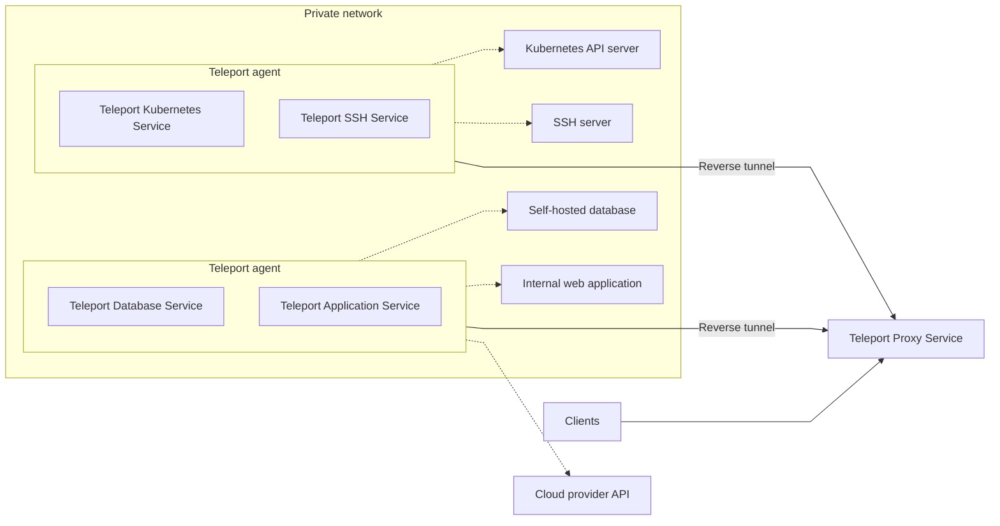

Teleport agents are Teleport instances that are configured to proxy traffic to
resources in your infrastructure, such as servers, databases, and Kubernetes
clusters.

This section shows you how to use Teleport agents to enable secure access to
your infrastructure.

## Architecture overview

### Services

Each Teleport agent can run one or more services.  A Teleport instance runs a
service if it is enabled within the instance's configuration file. See the
[Teleport Configuration
Reference](/ver/13.x/reference/config#enabling-teleport-services) for which
services are enabled by default and how to enable a particular service.

### Agent pools

Agents typically run in the same private networks as the resources they proxy.
They should be the only clients that can access a resource without Teleport.

In this setup, agents dial the Teleport Proxy Service in order to establish
reverse SSH tunnels. While the Proxy Service remains open to the public internet
via its HTTPS port, agents require no open ports or public address.

The Teleport Proxy Service uses these reverse tunnels to forward traffic in
Teleport's supported protocols to an available agent. Agents apply RBAC
rules and forward the traffic to resources in your infrastructure.

Read our guide for how to use Terraform to [deploy a pool of
agents](/ver/13.x/agents/deploy-agents-terraform).

## Joining agents

Teleport agents need to establish trust with the Teleport Auth Service in order
to authorize users to access your infrastructure. There are several ways to join
an agent to your Teleport cluster, making it possible to automate the join
process for your environment. Read about the available join methods in our [Join
Services to your Cluster](/ver/13.x/agents/join-services-to-your-cluster) guides.

## Enrolling infrastructure

There are two ways to enroll infrastructure resources with Teleport agents:

1. **Static**: Edit an agent's configuration file to configure a specific
   infrastructure resource to proxy.
2. **Dynamic**: Apply a [configuration
   resource](/ver/13.x/management/dynamic-resources) that configures a resource to
   proxy.

The dynamic method allows Teleport to discover resources automatically.  The
Discovery Service polls your cloud provider APIs and modifies dynamic
infrastructure resources as required.

[Read our guide](/ver/13.x/agents/deploy-agents-terraform) to deploying a pool of agents
via Terraform and enrolling infrastructure resources dynamically.

To learn how to enroll resources via static configuration files, plus all the
ways Teleport supports enrolling infrastructure, consult our guides to each of
Teleport's services:

- [SSH Service](/ver/13.x/server-access/introduction)
- [Database Service](/ver/13.x/database-access/introduction)
- [Kubernetes Service](/ver/13.x/kubernetes-access/introduction)
- [Windows Desktop Service](/ver/13.x/desktop-access/introduction)
- [Application Service](/ver/13.x/application-access/introduction)
